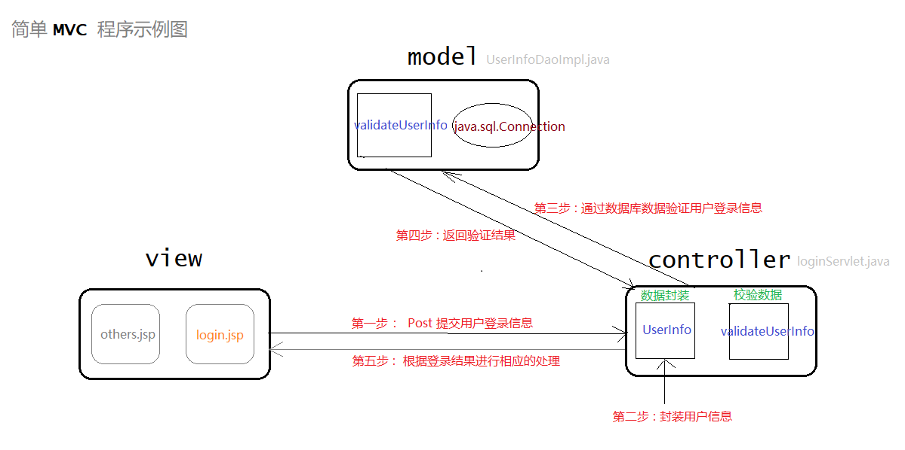

## 一个关于`JSP`的简单`MVC`案例

- *程序示例图如下所示 :*



- *`Java bean` : 封装用户的身份信息.*

```java
package pers.huangyuhui.servlet.bean;

/**
 * @ClassName: UserInfo
 * @Description: 用户信息
 * @author: HuangYuhui
 * @date: Apr 8, 2019 5:15:21 PM
 * 
 */
public class UserInfo {

	private String name;
	private String password;

	public UserInfo(String name, String password) {
		super();
		this.name = name;
		this.password = password;
	}

	public String getName() {
		return name;
	}

	public void setName(String name) {
		this.name = name;
	}

	public String getPassword() {
		return password;
	}

	public void setPassword(String password) {
		this.password = password;
	}

}

```

- *操作数据库的工具类*

```java
package pers.huangyuhui.servlet.util;

import java.sql.Connection;
import java.sql.DriverManager;
import java.sql.PreparedStatement;
import java.sql.ResultSet;
import java.sql.SQLException;
import java.sql.Statement;

/**
 * @ClassName: JDBCUtil
 * @Description: 操作数据库工具类
 * @author: HuangYuhui
 * @date: Apr 8, 2019 5:08:24 PM
 * 
 */
public class JDBCUtil {

	// initialize the driver of database.
	static {
		try {
			Class.forName("com.mysql.cj.jdbc.Driver");
		} catch (ClassNotFoundException e) {

			e.printStackTrace();
		}
	}

	// Return a database connection object.
	public static Connection getConnection() {
		Connection connection = null;
		try {
			connection = DriverManager.getConnection(
					"jdbc:mysql://LOCALHOST/DatabaseName?" + "useSSL=false&serverTimezone=UTC&allowPublicKeyRetrieval=true",
					"root", "DatabasePassword");
		} catch (SQLException e) {
			e.printStackTrace();
		}

		return connection;
	}

	// release the resource of connecting.
	public static void freeResource(Connection connection, PreparedStatement preparedStatement, ResultSet resultSet) {
		if (connection != null) {
			try {
				connection.close();
			} catch (SQLException e) {

				e.printStackTrace();
			}
		}
		if (preparedStatement != null) {
			try {
				preparedStatement.close();
			} catch (SQLException e) {

				e.printStackTrace();
			}
		}
		if (resultSet != null) {
			try {
				resultSet.close();
			} catch (SQLException e) {

				e.printStackTrace();
			}
		}
	}
}

```


- *`控制器(controller)` : 用于验证用户的登录信息并根据其结果作出相应的处理.*

```java
package pers.huangyuhui.servlet.controller;

import java.io.IOException;
import javax.servlet.ServletException;
import javax.servlet.annotation.WebServlet;
import javax.servlet.http.HttpServlet;
import javax.servlet.http.HttpServletRequest;
import javax.servlet.http.HttpServletResponse;

import pers.huangyuhui.servlet.bean.UserInfo;
import pers.huangyuhui.servlet.modImpl.DalidateUserInfo;

@WebServlet("/LoginServlet")
public class LoginServlet extends HttpServlet {
	private static final long serialVersionUID = 1L;

	public LoginServlet() {
		super();
	}

	protected void doGet(HttpServletRequest request, HttpServletResponse response)
			throws ServletException, IOException {

		request.setCharacterEncoding("utf-8");
		String name = request.getParameter("userName");
		String password = request.getParameter("userPassword");

		UserInfo userInfo = new UserInfo(name, password);
		boolean result = new DalidateUserInfo().vaildateUserInfo(userInfo);
		if (result) {
			// Sends a temporary redirect response to the client using thespecified redirect
			// location URL and clears the buffer.
			response.sendRedirect("weclome.jsp");
		} else {
			response.sendRedirect("error.jsp");
		}

	}

	protected void doPost(HttpServletRequest request, HttpServletResponse response)
			throws ServletException, IOException {

		doGet(request, response);
	}

}

```


- *用于操作用户信息的接口.*

```java
package pers.huangyuhui.servlet.model;
import pers.huangyuhui.servlet.bean.UserInfo;

/**
 * @ClassName: LoginDao
 * @Description: 操作用户信息的接口
 * @author: HuangYuhui
 * @date: Apr 8, 2019 5:53:53 PM
 * 
 */
public interface UserInfoDao {

	public boolean vaildateUserInfo(UserInfo userInfo);
}
```


- *`模型(model)` : 实现了操作用户信息接口的类.*

```java
package pers.huangyuhui.servlet.modImpl;

import java.sql.Connection;
import java.sql.PreparedStatement;
import java.sql.ResultSet;
import java.sql.SQLException;

import pers.huangyuhui.servlet.bean.UserInfo;
import pers.huangyuhui.servlet.model.UserInfoDao;
import pers.huangyuhui.servlet.util.JDBCUtil;

/**
 * @ClassName: DalidateUserInfo
 * @Description: 验证用户的身份信息
 * @author: HuangYuhui
 * @date: Apr 8, 2019 4:55:27 PM
 * 
 */
public class DalidateUserInfo implements UserInfoDao {

	private static String sql = "SELECT name,password FROM user WHERE NAME=? AND PASSWORD=?";
	// 节省JDBC连接资源.
	private static Connection connection = JDBCUtil.getConnection();
	private PreparedStatement preparedStatement;
	private ResultSet resultSet;

	public boolean vaildateUserInfo(UserInfo userInfo) {
		try {
			preparedStatement = connection.prepareStatement(sql);
			preparedStatement.setString(1, userInfo.getName());
			preparedStatement.setString(2, userInfo.getPassword());

			resultSet = preparedStatement.executeQuery();

			if (resultSet.next()) {
				return true;
			}

		} catch (SQLException e) {
			e.printStackTrace();
		} finally {
			JDBCUtil.freeResource(null, preparedStatement, resultSet);
		}
		return false;
	}
}

```


- *`视图(view)` : 用户登录界面.:*
  
```html
<%@ page language="java" contentType="text/html; charset=UTF-8"
    pageEncoding="UTF-8"%>
<!DOCTYPE html>
<html>
	<head>
		<meta charset="UTF-8">
		<title>Login in</title>
	</head>
		<body>
				<div align="center">
					<form action="LoginServlet" method="post">
						<table>
							<tr>
								<td>name</td>
								<td>
									<input type="text" name="userName"/>
								</td>
							</tr>
							<tr>
								<td>password</td>
								<td>
									<input type="text" name="userName"/>
								</td>
							</tr>
						</table><br>
						<input type="submit" value="login in" >
					</form>
				</div>
		</body>
</html>
```


- *日记 : 今天做了大学第一个兼职!在一个购物广场旁折风车,串风车,固定风车...中午吃坐在地上吃盒饭时让我突然想起了四年前撤学外出的自己,难忘的是青春哟!计划把外快买书嘿嘿嘿..(っ•̀ω•́)っ✎⁾⁾⁾*