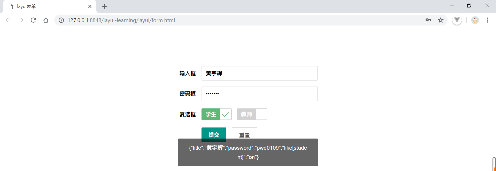

## 学习笔记 : 拥抱前端框架Layui
*layui 的出发点很简单 : `满足服务端程序员的需求`,因此可以毫不保留地说,layui 并非面向于前端开发者,所以在组织形式上毅然采用了几年前的以浏览器为宿主的类 AMD 模块管理方式. 对比EasyUI,Layui的作者`贤心`写出了如下评语,一直用EasyUI写小项目前端的我看后内心波涛汹涌,特么太生动了趴ヾ(=･ω･=)o*
```
Layui : 一个是邻家女孩，尚处芳龄，简而纯
EasyUI : 一个是彪悍妇女，昨日黄花，强而丑
```

### 官方简介
*官方简介 : layui(谐音:类UI)是一款采用自身模块规范编写的前端 UI 框架,遵循原生 HTML/CSS/JS 的书写与组织形式,门槛极低,拿来即用. 其外在极简,却又不失饱满的内在,体积轻盈,组件丰盈,从核心代码到 API 的每一处细节都经过精心雕琢,非常适合界面的快速开发. layui 首个版本发布于2016年金秋,她区别于那些基于 MVVM 底层的 UI 框架,却并非逆道而行,而是信奉返璞归真之道. 准确地说,她更多是为服务端程序员量身定做,你无需涉足各种前端工具的复杂配置,只需面对浏览器本身,让一切你所需要的元素与交互,从这里信手拈来~*

### 兼容性和面向场景
*layui 兼容人类正在使用的全部浏览器(IE6/7除外),可作为 PC 端后台系统与前台界面的速成开发方案*

### 主要模块
*layui 提供了丰富的内置模块,他们皆可通过模块化的方式按需加载,其中包括 : layer、layDate、layPage、laytpl、table、form、upload、element、tree、layeditor、rate、carousel、flow、util、code等..*

### 第一个Layui页面
*接下来通过Layui的表单模块,来快速写地一个简洁的用户登录页面 !ヾ(◍°∇°◍)ﾉﾞ*
```html
<!DOCTYPE html>
<html>
	<head>
		<meta charset="utf-8">
		<script src="../resources/layui/layui-v2.5.4/layui/layui.js"></script>
		<link rel="stylesheet" href="../resources/layui/layui-v2.5.4/layui/css/layui.css">
		<title>layui表单</title>
	</head>
	<body>
		<form style="margin-left: 400px;padding-top: 100px;" class="layui-form" action="">
			<div class="layui-form-item">
				<label class="layui-form-label">输入框</label>
				<div class="layui-input-inline">
					<input type="text" name="title" style="width: 300px;" required lay-verify="required" placeholder="请输入账号"
					 autocomplete="off" class="layui-input">
				</div>
			</div>
			<div class="layui-form-item">
				<label class="layui-form-label">密码框</label>
				<div class="layui-input-inline">
					<input type="password" name="password" style="width: 300px;" required lay-verify="required" placeholder="请输入密码"
					 autocomplete="off" class="layui-input">
				</div>
			</div>
			<div class="layui-form-item">
				<label class="layui-form-label">复选框</label>
				<div class="layui-input-block">
					<input type="checkbox" name="like[student]" title="学生">
					<input type="checkbox" name="like[teacher]" title="教师" checked>
				</div>
			</div>
			<div class="layui-form-item">
				<div class="layui-input-block">
					<button class="layui-btn" lay-submit lay-filter="formDemo">提交</button>
					<button type="reset" class="layui-btn layui-btn-primary">重置</button>
				</div>
			</div>
		</form>

		<script>
			//Demo
			layui.use('form', function() {
				var form = layui.form;
				//监听提交
				form.on('submit(formDemo)', function(data) {
					layer.msg(JSON.stringify(data.field));
					return false;
				});
			});
		</script>
	</body>
</html>
```

*程序运行结果如下所示,是不是感觉瞬间爱上Layui了呢 !*



*✨ Layui官方使用文档 : https://www.layui.com/doc/*