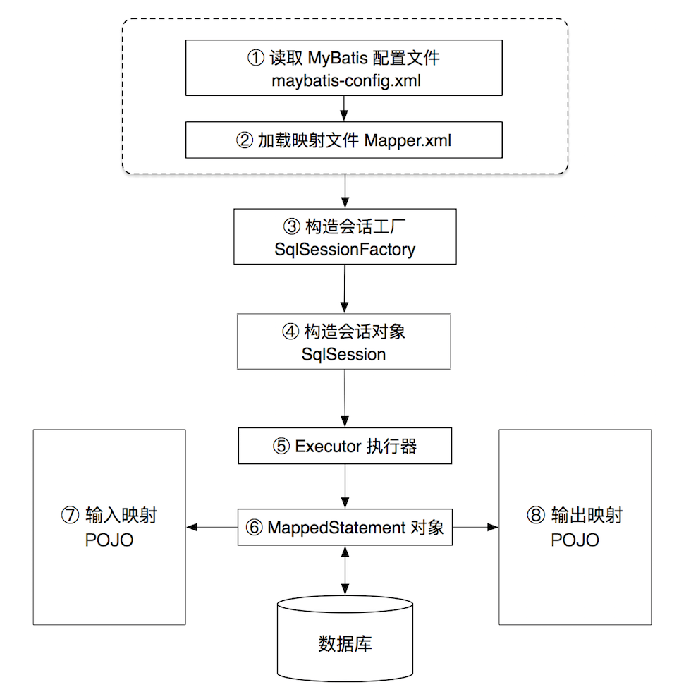

## 学习笔记 : 初识MyBatis
*简介 : `MyBatis`的前身是`iBATIS`,是Clinton Begin在2001年发起的一个开源项目,最初侧重于密码软件的开发,后来发展成为一款基于Java的持久层框架.2004年,Clinton将iBATIS的名字和源码捐赠给了Apache软件基金会.2010年,核心开发团队决定离开Apache软件基金会,并且将iBATIS该名为MyBatis.*


### MyBatis 工作原理
*MyBatis框架执行流程图如下所示 :*



*从MyBatis框架执行流程图中可得知,MyBatis框架在操作数据库时,大体经过了8个步骤.下面对每一步进行详解哟 ~*
1. 读取MyBatis配置文件`mybatis-config.xml`.其作为MyBatis的全局配置文件,配置了MyBatis的运行环境等信息,其中主要内容是获取数据库连接.
   
2. 加载映射配置文件`Mapper.xml`.既SQL映射文件,该文件配置了操作数据库的SQL语句,需要在`mybatis-config.xml`中加载才能执行.`mybatis-config.xml`可以加载多个配置文件,每个配置文件对应数据库中的一张表.
   
3. 构建会话工厂.通过MyBatis的环境等配置信息构建会话工厂`SqlSessionFactory`.

4. 创建`SqlSession`对象.由会话工厂创建SqlSession对象,该对象中包含了执行SQL的所有方法.

5. MyBatis底层定义了一个`Executor`接口来操作数据库,它会根据`SqlSession`传递的参数动态地生成需要执行的SQL语句,同时负责查询缓存的维护.

6. 在`Executor`接口的执行方法中,包含一个`MappedStatement`类型的参数,该参数是对映射信息的封装,用于存储要映射的SQL语句的id,参数等.. `Mapper.xml`文件中一个SQL对应一个MappedStatement对象,SQL的id既是MappedStatement的id.

7. 输入参数映射,其过程类似于JDBC编程中对preparedStatement对象设置参数的过程.

8. 输出参数映射,其过程类似于JDBC编程中对结果的解析处理过程.


### MyBatis 入门程序
1. *User.java : 一个简单Java bean*
```java
package pers.huangyuhui.mybatis.bean;

/**
 * @ClassName: User
 * @Description: 封装用户信息
 * @author: HuangYuhui
 * @date: May 9, 2019 5:07:23 PM
 *
 */
public class User {

	private Integer id;
	private String name;
	private String gender;
	private String email;

	public Integer getId() {
		return id;
	}

	public void setId(Integer id) {
		this.id = id;
	}

	public String getName() {
		return name;
	}

	public void setName(String name) {
		this.name = name;
	}

	public String getGender() {
		return gender;
	}

	public void setGender(String gender) {
		this.gender = gender;
	}

	public String getEmail() {
		return email;
	}

	public void setEmail(String email) {
		this.email = email;
	}

	@Override
	public String toString() {
		return "User [id=" + id + ", name=" + name + ", gender=" + gender + ", email=" + email + "]";
	}

}
```

2. *db.properties : 数据库配置信息文件.*
```t
#database configuration information
jdbc.driver=com.mysql.cj.jdbc.Driver
jdbc.url=jdbc:mysql://LOCALHOST/MyBatis?useSSL=false&serverTimezone=UTC&allowPublicKeyRetrieval=true
jdbc.username=root
jdbc.password=GoodTime
```

1. *mybatis-config.xml : MyBatis核心配置文件*
```xml
<?xml version="1.0" encoding="UTF-8" ?>
<!DOCTYPE configuration
 PUBLIC "-//mybatis.org//DTD Config 3.0//EN"
 "http://mybatis.org/dtd/mybatis-3-config.dtd">
<configuration>
	<!-- 读取数据库配置文件 -->
	<properties resource="db.properties" />
	<!-- 配置环境-默认环境id为MySQL -->
	<environments default="MySQL">
		<environment id="MySQL">
			<!-- 使用JDBC事务管理 -->
			<transactionManager type="JDBC" />
			<!-- 数据库连接池 -->
			<dataSource type="POOLED">
				<property name="driver" value="${jdbc.driver}" />
				<property name="url" value="${jdbc.url}" />
				<property name="username" value="${jdbc.username}" />
				<property name="password" value="${jdbc.password}" />
			</dataSource>
		</environment>
	</environments>
	<!-- 将sql映射文件注册到全局配置文件中 -->
	<mappers>
		<mapper resource="UserMapper.xml" />
	</mappers>
</configuration>
```

4. *UserTest.java : 测试类*
```java
package pers.huangyuhui.mybatis.bean.test;

import java.io.IOException;
import java.io.InputStream;

import org.apache.ibatis.io.Resources;
import org.apache.ibatis.session.SqlSession;
import org.apache.ibatis.session.SqlSessionFactory;
import org.apache.ibatis.session.SqlSessionFactoryBuilder;
import org.junit.jupiter.api.Test;

import pers.huangyuhui.mybatis.bean.User;

/**
 * @ClassName: UserTest
 * @Description: Test Mybatis
 * @author: HuangYuhui
 * @date: May 9, 2019 5:26:52 PM
 *
 */
public class UserTest {

	InputStream inputStream;
	SqlSessionFactory sqlSessionFactory;
	SqlSession sqlSession;

	@Test
	public void test() {

		try {
			// 读取配置文件
			inputStream = Resources.getResourceAsStream("mybatis-config.xml");
			// 根据配置文件构建会话工厂对象
			SqlSessionFactory sqlSessionFactory = new SqlSessionFactoryBuilder().build(inputStream);
			// 通过SqlSessionFactory创建SqlSession
			sqlSession = sqlSessionFactory.openSession();
			// 执行映射文件中定义的SQL并返回映射结果
			User user = sqlSession.selectOne("Namespace.UserInfoMapper.SelectUserInfoByID", 1);

			System.out.println(user);

		} catch (IOException e) {
			e.printStackTrace();
		} finally {
			sqlSession.close();
		}

	}
}
```

5. *log4j.properties : 日志文件(便于查看MyBatis操作数据库的过程).*
```t
#Global configuration
log4j.rootLogger=DEBUG,stdout
#Log configuration
log4j.logger.pers.huangyuhui.mybatis.bean.test=TRACE
#Console configuration
log4j.appender.stdout=org.apache.log4j.ConsoleAppender
log4j.appender.stdout.layout=org.apache.log4j.PatternLayout
log4j.appender.stdout.layout.layout.ConversionPattern=%5p [%t] - %m%n
```

6. *程序运行结果如下所示*
```
Logging initialized using 'class org.apache.ibatis.logging.log4j.Log4jImpl' adapter.
PooledDataSource forcefully closed/removed all connections.
PooledDataSource forcefully closed/removed all connections.
PooledDataSource forcefully closed/removed all connections.
PooledDataSource forcefully closed/removed all connections.
Opening JDBC Connection
Created connection 1238080693.
Setting autocommit to false on JDBC Connection [com.mysql.cj.jdbc.ConnectionImpl@49cb9cb5]

==>  Preparing: select id,name,gender,email from Test_MyBatis where id = ? 
==> Parameters: 1(Integer)
<==      Total: 1
User [id=1, name=YUbuntu0109, gender=M, email=Gentleman_0109@outlook.com]

Resetting autocommit to true on JDBC Connection [com.mysql.cj.jdbc.ConnectionImpl@49cb9cb5]
Closing JDBC Connection [com.mysql.cj.jdbc.ConnectionImpl@49cb9cb5]
Returned connection 1238080693 to pool.
```