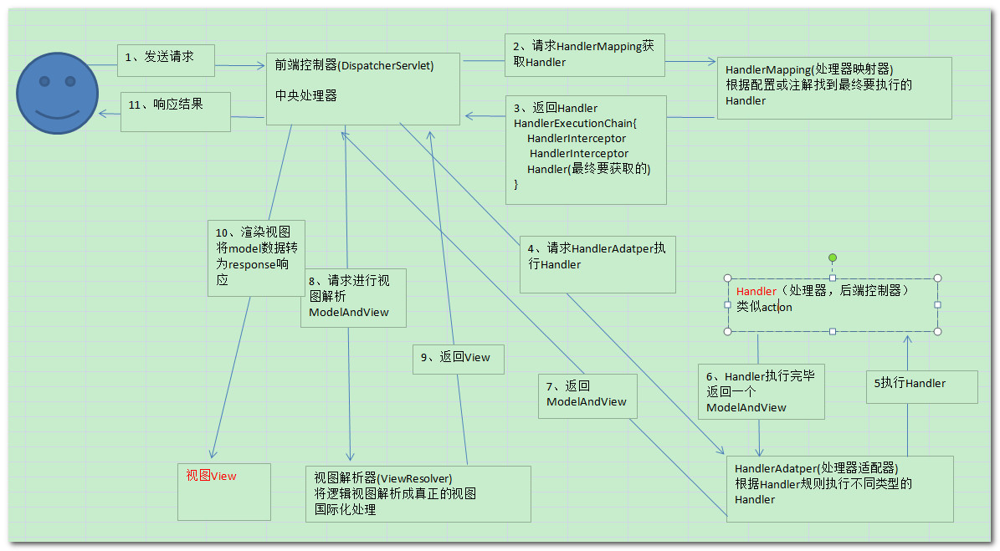

## 学习笔记 : Spring MVC入门

### Spring MVC概述
*`Spring MVC`是`Spring`提供的一个实现了Web MVC设计模式的轻量级Web框架. Spring MVC具有如下特点 :*
1. 支持国际化.
2. 支持多种视图技术.
3. 灵活性强,易于与其它框架集成.
4. 内置常见效验器,可以效验用户输入.
5. 可自动绑定用户输入,并正确的转换数据类型.
6. 使用基于XML的配置文件,编写后无需重新编译应用程序.
7. 提供了一个前端控制器`DispatcherServlet`,使开发人员无须额外开发控制器对象.


### Spring MVC的工作流程
*Spring MVC的工作原理图如下所示.*



### 第一个Spring MVC应用程序
1. *第一步: 配置前端控制器*
```xml
<?xml version="1.0" encoding="UTF-8"?>
<web-app xmlns:xsi="http://www.w3.org/2001/XMLSchema-instance" 
	xmlns="http://xmlns.jcp.org/xml/ns/javaee" 
	xsi:schemaLocation="http://xmlns.jcp.org/xml/ns/javaee http://xmlns.jcp.org/xml/ns/javaee/web-app_4_0.xsd" 
	id="WebApp_ID" version="4.0">
    
  <display-name>Hi_SpringMVC</display-name>
  <welcome-file-list>
    <welcome-file>index.jsp</welcome-file>
  </welcome-file-list>
  <servlet>
  	<!-- 配置前端过滤器 -->
    <servlet-name>spring_mvc</servlet-name>
    <servlet-class>org.springframework.web.servlet.DispatcherServlet</servlet-class>
    <!-- 初始化时加载配置文件 -->
    <init-param>
      <param-name>contextConfigLocation</param-name>
      <param-value>classpath:springmvc-config.xml</param-value>
    </init-param>
    <!-- 使容器在启动时立即加载Servlet -->
    <load-on-startup>1</load-on-startup>
  </servlet>
  <servlet-mapping>
    <servlet-name>spring_mvc</servlet-name>
    <url-pattern>/</url-pattern>
  </servlet-mapping>
</web-app>
```

2. *第二步: 创建Controller类*
```java
package pers.huangyuhui.springmvc.controller;

import javax.servlet.http.HttpServletRequest;
import javax.servlet.http.HttpServletResponse;

import org.springframework.web.servlet.ModelAndView;
import org.springframework.web.servlet.mvc.Controller;

/**
 * @ClassName: FirstController
 * @Description: 控制器
 * @author: HuangYuhui
 * @date: May 22, 2019 2:51:16 PM
 *
 */
public class FirstController implements Controller {

	@Override
	public ModelAndView handleRequest(HttpServletRequest arg0, HttpServletResponse arg1) throws Exception {

		// 创建ModelAndView对象
		ModelAndView modelAndView = new ModelAndView();
		// 向模型中添加数据
		modelAndView.addObject("msg", "This is my first Spring MVC program ~");
		// 设置了逻辑视图名
		modelAndView.setViewName("/WEB-INF/view/HiSpringMVC.jsp");

		return modelAndView;
	}

}
```

3. *第三步: 创建Spring MVC的配置文件,配置控制器映射信息*
```xml
<?xml version="1.0" encoding="UTF-8"?>
<beans xmlns="http://www.springframework.org/schema/beans"
	xmlns:xsi="http://www.w3.org/2001/XMLSchema-instance"
	xsi:schemaLocation="http://www.springframework.org/schema/beans 
	http://www.springframework.org/schema/beans/spring-beans.xsd">

	<!-- 配置处理器Handle,映射 `/firstController`请求 -->
	<bean name="/FirstController" class="pers.huangyuhui.springmvc.controller.FirstController" />

	<!-- 处理器映射器:将处理器Handle的name作为url进行查找 -->
	<bean class="org.springframework.web.servlet.handler.BeanNameUrlHandlerMapping" />

	<!-- 处理器适配器:配置对处理器中handleRequest()方法的调用 -->
	<bean class="org.springframework.web.servlet.mvc.SimpleControllerHandlerAdapter" />

	<!-- 截图解析器 -->
	<bean class="org.springframework.web.servlet.view.InternalResourceViewResolver" />

</beans>
```
- *注意: 在Spring 4.0以后,如果不配置处理器映射器,处理器适配器和视图解析器,也会使用Spring内部默认的配置来完成相应的工作呦~ 这里没有省略是为了更清晰地展示Spring MVC的工作流程.*

4. *第四步: 创建视图页面*
```html
<%@ page language="java" contentType="text/html; charset=UTF-8"
	pageEncoding="UTF-8"%>
<!DOCTYPE html>
<html>
<head>
<meta charset="UTF-8">
<title>Hi SpringMVC ~</title>
</head>
<body>
	<h2 align="center">${msg }</h2>
</body>
</html>
```

5. *第五步: 启动Tomcat服务器,在浏览器中访问地址: `http://localhost:8080/Hi_SpringMVC/FirstController` 其效果图如下.*
