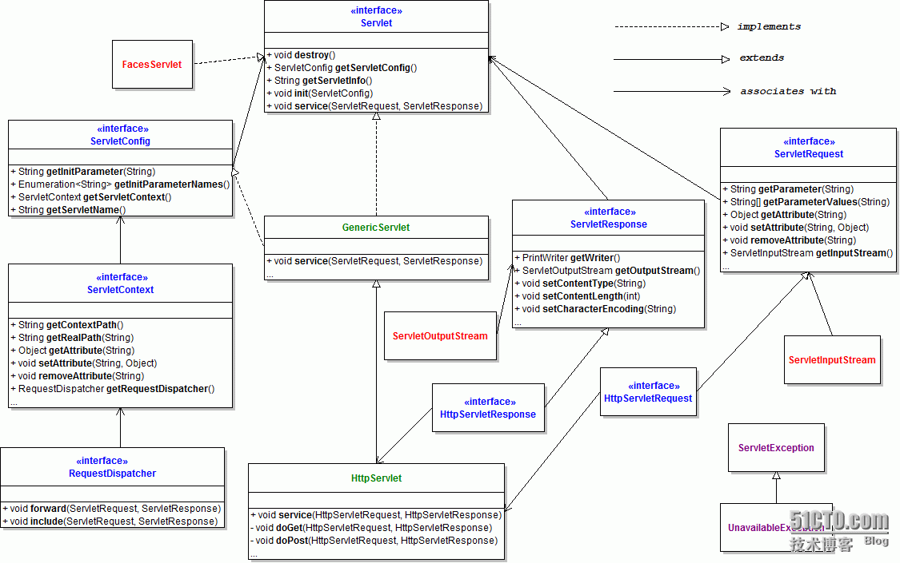

## 学习笔记 : Servlet API

- *Servlet 体系结构图如下*
- 

### Servlet 2.5 示例程序

- *web.xml*
```xml
<?xml version="1.0" encoding="UTF-8"?>
<web-app xmlns:xsi="http://www.w3.org/2001/XMLSchema-instance" xmlns="http://xmlns.jcp.org/xml/ns/javaee" xsi:schemaLocation="http://xmlns.jcp.org/xml/ns/javaee http://xmlns.jcp.org/xml/ns/javaee/web-app_4_0.xsd" id="WebApp_ID" version="4.0">
  <display-name>Servlet_basic_lifecycle</display-name>
  <welcome-file-list>
    <welcome-file>index.html</welcome-file>
    <welcome-file>index.htm</welcome-file>
    <welcome-file>index.jsp</welcome-file>
    <welcome-file>default.html</welcome-file>
    <welcome-file>default.htm</welcome-file>
    <welcome-file>default.jsp</welcome-file>
  </welcome-file-list>
  <context-param>
    <param-name>GlobalParamName</param-name>
    <param-value>Web容器中的初始化参数值 ..</param-value>
  </context-param>
  <servlet>
    <servlet-name>sameName</servlet-name>
    <servlet-class>pers.huangyuhui.servlet.test.ServletAPI</servlet-class>
    <init-param>
      <param-name>ServletParamName</param-name>
      <param-value>当前Servlet的初始化参数值 ..</param-value>
    </init-param>
    <load-on-startup>1</load-on-startup>
  </servlet>
  <servlet-mapping>
    <servlet-name>sameName</servlet-name>
    <url-pattern>/ServletAPI</url-pattern>
  </servlet-mapping>
</web-app>
```

- *Servlet program*
```java

/*
 * ServletConfig 接口中的方法解析如下 : 
 *  1.ServletContext getServletContext(): 获取Servlet上下文对象,如: application.. 
 *  2.String getInitParameter(String name): 在当前Servlet范围内,获取名为name的参数. ...
 * 
 * ServletContext类中的常用方法解析 : 
 *  1.getContextPath(): 相对路径. GetRealPath(): 绝对路径.
 *  2.String getInitParameter(String name): 在当前Web容器范围内,获取名为name的参数值(初始化参数值).
 * 
 */
public class ServletAPI extends HttpServlet {

	private static final long serialVersionUID = -4244028101944729741L;
	
	@Override
	public void init() throws ServletException {
		//super.init();
		System.out.println("( Servlet 2.5 )This is init() ..");
		
		/*
		 * 获取当前Servlet的初始化参数.
		 * String getInitParameter(String name): 在当前Servlet范围内,获取名为name的参数.
		 */
		String  value = super.getInitParameter("ServletParamName");  //web.xml
		System.out.println("当前的Servlet的参数`ServletParamName`的值为 : "+value);
		
		/*
		 * 获取当前Web容器的初始化参数.
		 * String getInitParameter(String name): 在当前Web容器范围内,获取名为name的参数值(初始化参数值).
		 */
		ServletContext servletContext = this.getServletContext();
		String globalValue = servletContext.getInitParameter("GlobalParamName");  //web.xml
		System.out.println("当前Web容器的参数`GobalParamName`的值为 : "+globalValue);
	
	}

	@Override
	protected void doGet(HttpServletRequest req, HttpServletResponse resp) throws ServletException, IOException {
		//super.doGet(req, resp);
		System.out.println("( Servlet 2.5 )service() -> doGet()+doPost() ..");
	}
	
	@Override
	protected void doPost(HttpServletRequest req, HttpServletResponse resp) throws ServletException, IOException {
		//super.doPost(req, resp);
		doGet(req, resp);
	}	
	
	@Override
	public void destroy() {
		//super.destroy();
		System.err.println("( Servlet 2.5 )This is destory() ..");
	}
}

/*### The result be shown as followed : 

Apr 06, 2019 6:45:24 PM org.apache.jasper.servlet.TldScanner scanJars
INFO: At least one JAR was scanned for TLDs yet contained no TLDs. Enable debug logging for this logger for a complete list of JARs that were scanned but no TLDs were found in them. Skipping unneeded JARs during scanning can improve startup time and JSP compilation time.
( Servlet 2.5 )This is init() ..			<———the result
当前的Servlet的参数`ServletParamName`的值为 : 当前Servlet的初始化参数值 ..				<———the result
当前Web容器的参数`GobalParamName`的值为 : Web容器中的初始化参数值 ..		                <———the result
Apr 06, 2019 6:45:24 PM org.apache.jasper.servlet.TldScanner scanJars
INFO: At least one JAR was scanned for TLDs yet contained no TLDs. Enable debug logging for this logger for a complete list of JARs that were scanned but no TLDs were found in them. Skipping unneeded JARs during scanning can improve startup time and JSP compilation time.
Apr 06, 2019 6:45:25 PM org.apache.jasper.servlet.TldScanner scanJars
INFO: At least one JAR was scanned for TLDs yet contained no TLDs. Enable debug logging for this logger for a complete list of JARs that were scanned but no TLDs were found in them. Skipping unneeded JARs during scanning can improve startup time and JSP compilation time.
Apr 06, 2019 6:45:25 PM org.apache.coyote.AbstractProtocol start
INFO: Starting ProtocolHandler ["http-nio-8080"]
Apr 06, 2019 6:45:25 PM org.apache.coyote.AbstractProtocol start
INFO: Starting ProtocolHandler ["ajp-nio-8009"]
Apr 06, 2019 6:45:25 PM org.apache.catalina.startup.Catalina start
INFO: Server startup in [3,136] milliseconds
( Servlet 2.5 )service() -> doGet()+doPost() ..			<———the result

 */

```

### Servlet 3.0 示例程序

- *web.xml*
```xml
<?xml version="1.0" encoding="UTF-8"?>
<web-app xmlns:xsi="http://www.w3.org/2001/XMLSchema-instance" xmlns="http://xmlns.jcp.org/xml/ns/javaee" xsi:schemaLocation="http://xmlns.jcp.org/xml/ns/javaee http://xmlns.jcp.org/xml/ns/javaee/web-app_4_0.xsd" id="WebApp_ID" version="4.0">
  <display-name>ServletAPI_3.0</display-name>
  <welcome-file-list>
    <welcome-file>index.html</welcome-file>
    <welcome-file>index.htm</welcome-file>
    <welcome-file>index.jsp</welcome-file>
    <welcome-file>default.html</welcome-file>
    <welcome-file>default.htm</welcome-file>
    <welcome-file>default.jsp</welcome-file>
  </welcome-file-list>
    <!-- 
     	注意: 全局的Web容器的参数是无法通过注解来配置的.毕竟注解只隶属于具体的一个Servlet,因此无法为整个Web容器设置初始化参数.
     	而全局的Web参数并不属任何一个Servlet.如果使用Servlet 3.0需要在web.xml配置文件中初始化该参数.
    	毕竟web.xml是属于整个容器的配置文件.
     -->
     <context-param>
	    <param-name>GobalParamName</param-name>
	    <param-value>GlobalParamValue</param-value>
	</context-param>
</web-app>
```

- *Servlet program*
```java
/*
 * 通过注解为当前Servlet初始化参数.如下所示.
 */
@WebServlet(value="/ServletAPI",loadOnStartup=1,initParams= {@WebInitParam(name="ServletParamName",value="ServletParamValue")})
public class ServletAPI extends HttpServlet {

	private static final long serialVersionUID = -4244028101944729741L;
	
	@Override
	public void init() throws ServletException {
		//super.init();
		System.out.println("( Servlet 3.0 )This is init() ..");
		
		/*
		 * 获取当前Servlet的初始化参数.
		 * String getInitParameter(String name): 在当前Servlet范围内,获取名为name的参数.
		 */
		String  value = super.getInitParameter("ServletParamName");  //web.xml
		System.out.println("当前的Servlet的参数`ServletParamName`的值为 : "+value);
		
		/*
		 * 获取当前Web容器的初始化参数.
		 * String getInitParameter(String name): 在当前Web容器范围内,获取名为name的参数值(初始化参数值).
		 */
		ServletContext servletContext = this.getServletContext();
		String globalValue = servletContext.getInitParameter("GlobalParamName");  //web.xml
		System.out.println("当前Web容器的参数`GobalParamName`的值为 : "+globalValue);
	
	}	

	@Override
	protected void doGet(HttpServletRequest req, HttpServletResponse resp) throws ServletException, IOException {
		//super.doGet(req, resp);
		System.out.println("( Servlet 3.0 )service() -> doGet()+doPost() ..");
	}	

	@Override
	protected void doPost(HttpServletRequest req, HttpServletResponse resp) throws ServletException, IOException {
		//super.doPost(req, resp);
		doGet(req, resp);
	}
		
	@Override
	public void destroy() {
		//super.destroy();
		System.err.println("( Servlet 3.0 )This is destory() ..");
	}
}

/*###The result be shown as followed : 

Apr 07, 2019 6:52:11 PM org.apache.jasper.servlet.TldScanner scanJars
INFO: At least one JAR was scanned for TLDs yet contained no TLDs. Enable debug logging for this logger for a complete list of JARs that were scanned but no TLDs were found in them. Skipping unneeded JARs during scanning can improve startup time and JSP compilation time.
( Servlet 3.0 )This is init() ..			<———the result
当前的Servlet的参数`ServletParamName`的值为 : ServletParamValue		    <———the result
当前Web容器的参数`GobalParamName`的值为 : GlobalParamValue		        <———the result
Apr 07, 2019 6:52:11 PM org.apache.coyote.AbstractProtocol start
INFO: Starting ProtocolHandler ["http-nio-8080"]		
Apr 07, 2019 6:52:11 PM org.apache.coyote.AbstractProtocol start
INFO: Starting ProtocolHandler ["ajp-nio-8009"]
Apr 07, 2019 6:52:11 PM org.apache.catalina.startup.Catalina start
INFO: Server startup in [2,502] milliseconds
( Servlet 3.0 )service() -> doGet()+doPost() ..		<———the result

 */
```

