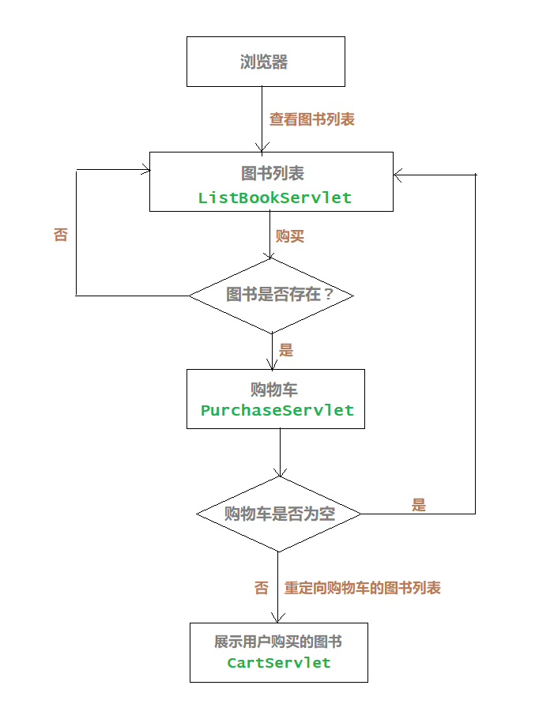
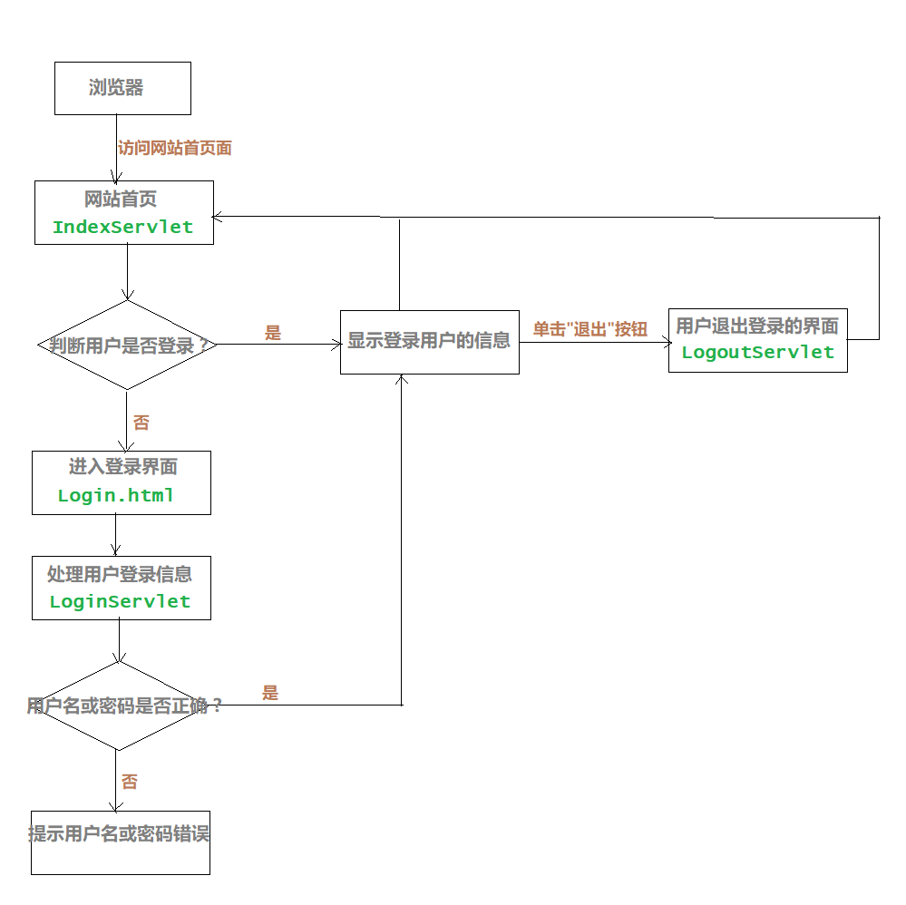

## 学习笔记 : Java web之会话及其会话技术

### 概述
*在Web开发中,服务器跟踪用户信息的技术成为会话技术,它指的是一个客户端(浏览器)与Web服务器之间连续发生的一系列请求和响应的过程.为了保存会话过程中产生的数据,在Servlet技术中,提供了两个用于保存会话数据的对象,分别是`Cookie`和`Session`.*


### Cookie object
*`Cooke`是一种会话技术,它用于将会话过程中的数据保存到用户的浏览器中,从而使浏览器和服务器可以更好地进行数据交互.Cookie在浏览器和服务器之间的传输过程示例图如下 :*


### Cookie application

#### 显示用户上次访问时间
*案例描述 : 当用户请求LastAccessServlet时,服务器会调用`HttpServletResponse`接口的`addCookie(Cookie cookie)`方法,该方法会在发送给浏览器的HTTP响应消息中增加一个`Set-Cookie`头字段,将创建的Cookie对象作为Set-Cookie头字段的值传递给浏览器.示例程序如下 :*
```java
@WebServlet("/LastAccessServlet")
public class LastAccessServlet extends HttpServlet {
	private static final long serialVersionUID = 1L;

	public LastAccessServlet() {
		super();
	}

	protected void doGet(HttpServletRequest request, HttpServletResponse response)
			throws ServletException, IOException {

		response.setContentType("text/html;charset=utf-8");

		String lastAccessTime = null;// 最后一次登录的时间

		// 获取所有cookie,并将其存放到数组中
		Cookie[] cookies = request.getCookies();
		for (int i = 0; cookies != null && i < cookies.length; i++) {
			// 如果cookie的名称为lastAccess,则获取其对应的cookie值
			if ("lastAccess".equals(cookies[i].getName())) {
				lastAccessTime = cookies[i].getValue();
				break;
			}
		}

		// 判断是否存在名称为lastAccess的cookie
		if (lastAccessTime == null) {
			response.getWriter().println("the first to visit this page !");
		} else {
			response.getWriter().println("the time of last visited : " + lastAccessTime);
		}

		// 创建cookie,并将当前时间作为名为lastAccess的cookie的值
		String currentTime = new SimpleDateFormat("YYYY-MM-dd—>hh:mm:ss").format(new Date());
		Cookie cookie = new Cookie("lastAccess", currentTime);
		// 设置Cookie对象在客户端的存活时长,默认值为 -1
		cookie.setMaxAge(60);
		// 设置该Cookie项的有效目录路径
		cookie.setPath("/Cookie-Session_basic");

		// 发送cookie到客户端
		response.addCookie(cookie);
	}

	protected void doPost(HttpServletRequest request, HttpServletResponse response)
			throws ServletException, IOException {
		doGet(request, response);
	}

}
```


### Session object
*`Cookie`技术可以将用户的信息保存在各自的浏览器中,并且可以在多次请求下实现数据的共享.但是,如果传递的信息比较多,使用Cookie技术显然会增加服务器端程序处理的难度.这时,可以使用`Session`实现,Session是一种将会话数据保存到服务器端的技术.当浏览器访问Web服务器时,`Servlet容器`就会创建一个`Session对象`和`ID属性`,当客户端后续访问服务器时,只要将标识号传递给服务器,服务器就能判断出该请求是哪个客户端发送的,从而选择与之对应的Session对象为其服务.需要注意的是 : 由于客端户需要接收,记录,回送Session对象的ID,因此,通常情况下,`Session是借助Cookie技术来传递ID属性的 !`*

#### HttpSession API
*Session是与每个请求消息紧密相关的,HttpServletRequest接口中定义了用于获取Session对象的getSession()方法,该方法有两种重载形式.*
```java
// 根据传递的参数来判断是否创建新的HttpSession对象
public HttpSession getSession(boolean create);
// 在相关的HttpSession对象不存在时总是创建新的HttpSession对象
public HttpSession getSession();
```

#### Session超时管理
*为了解决不再使用的`HttpSession`对象会在Web服务器中因积累过多从而导致Web服务器内存耗尽的问题,Web服务器采用了`超时限制`的办法来判断客户端是否还在继续访问.在会话过程中,会话的有效时间可以在`web.xml`文件中设置,其默认值由Servlet容器定义.如果想使站点内的所有Web应用程序都起作用,可以配置`<Tomcat directory>\conf\web.xml`文件,如下所示 :*
```xml
<!-- ==================== Default Session Configuration ================= -->
  <!-- You can set the default session timeout (in minutes) for all newly -->
  <!-- created sessions by modifying the value below.                     -->

    <session-config>
        <session-timeout>30</session-timeout>
    </session-config>
```


### Session application

#### 实现购物车
*案例描述 : 购物车的的实现流程如下图所示,当用户使用浏览器访问某个网站的图书列表页面时,如果购买某一本书,那么首先会判断书籍是否存在,如果存在就加入购物车,跳转到购物车中所购买图书的列表页,否则,返回图书列表页面.*



1. *Book.java : 用于封装图书的信息.*
```java
package pers.huangyuhui.session.example.shoppingtrolley;

/**
 * @ClassName: Book
 * @Description: 封装图书的信息
 * @author: HuangYuhui
 * @date: Apr 29, 2019 4:52:20 PM
 * 
 */
public class Book {

	private String id;
	private String name;

	public Book(String book_id, String book_name) {
		id = book_id;
		name = book_name;
	}

	public String getId() {
		return id;
	}

	public void setId(String id) {
		this.id = id;
	}

	public String getName() {
		return name;
	}

	public void setName(String name) {
		this.name = name;
	}

}
```

2. *BookDB.java : 用于模拟保存所有图书的数据库.*
```java
package pers.huangyuhui.session.example.shoppingtrolley;

import java.util.Collection;
import java.util.LinkedHashMap;
import java.util.Map;

/**
 * @ClassName: BookDB
 * @Description: 模拟保存所有图书的数据库
 * @author: HuangYuhui
 * @date: Apr 29, 2019 4:56:02 PM
 * 
 */
public class BookDB {

	private static Map<String, Book> books = new LinkedHashMap<String, Book>();

	static {

		books.put("1", new Book("1", "《Java web 入门》"));
		books.put("2", new Book("2", "《Java web 进阶》"));
		books.put("3", new Book("3", "《Spring》"));
		books.put("4", new Book("4", "《Spring MVC》"));
		books.put("5", new Book("5", "《MyBatis》"));
	}

	// 获取所有的图书
	public static Collection<Book> getall() {

		return books.values();
	}

	// 根据指定的id获取图书
	public static Book getBook(String book_id) {
		return books.get(book_id);
	}
}
```

3. *ListBookServlet.java : 用于显示所有可购买图书的列表.通过点击"click to buy"链接,便可将指定的图书添加到购物车中.*
```java
package pers.huangyuhui.session.example.shoppingtrolley;

import java.io.IOException;
import java.io.PrintWriter;
import java.util.Collection;

import javax.servlet.ServletException;
import javax.servlet.annotation.WebServlet;
import javax.servlet.http.HttpServlet;
import javax.servlet.http.HttpServletRequest;
import javax.servlet.http.HttpServletResponse;

/**
 * @ClassName: ListBookServlet
 * @Description: 显示所有可购买图书的列表
 * @author: HuangYuhui
 * @date: Apr 29, 2019 5:05:12 PM
 *
 */
@WebServlet("/ListBookServlet")
public class ListBookServlet extends HttpServlet {
	private static final long serialVersionUID = 1L;

	public ListBookServlet() {
		super();
	}

	protected void doGet(HttpServletRequest request, HttpServletResponse response)
			throws ServletException, IOException {
		response.setContentType("text/html;charset=utf-8");

		PrintWriter printWriter = response.getWriter();
		Collection<Book> bookInfo = BookDB.getall();

		printWriter.println("<h3 align='center'>All of book be shown as followed</h3><hr/>");
		for (Book book : bookInfo) {
			String url = "/Cookie-Session_basic/PurchaseServlet?id=" + book.getId();
			printWriter.println(book.getName() + "<a href=' " + url + " '>click to buy ..</a><br>");
		}

	}

	protected void doPost(HttpServletRequest request, HttpServletResponse response)
			throws ServletException, IOException {
		doGet(request, response);
	}

}
```

4. *PurchaseServlet.java : 功能一: 将用户购买的图书信息保存到Session对象中. 功能二: 在用户购买图书结束后,将页面重定向到用户已经购买的图书列表.*
```java
package pers.huangyuhui.session.example.shoppingtrolley;

import java.io.IOException;
import java.util.ArrayList;
import java.util.List;

import javax.servlet.ServletException;
import javax.servlet.annotation.WebServlet;
import javax.servlet.http.Cookie;
import javax.servlet.http.HttpServlet;
import javax.servlet.http.HttpServletRequest;
import javax.servlet.http.HttpServletResponse;
import javax.servlet.http.HttpSession;

/**
 * @ClassName: PurchaseServlet
 * @Description: 购买图书
 * @author: HuangYuhui
 * @date: May 2, 2019 5:17:54 PM
 *
 */
@WebServlet("/PurchaseServlet")
public class PurchaseServlet extends HttpServlet {
	private static final long serialVersionUID = 1L;

	public PurchaseServlet() {
		super();
	}

	protected void doGet(HttpServletRequest request, HttpServletResponse response)
			throws ServletException, IOException {

		// 获得用户购买的商品
		String book_id = request.getParameter("id");

		// 如果book_id为空,重定向到ListBookServlet页面
		if (book_id == null) {
			response.sendRedirect("/ListBookServlet");
			return;
		}
		Book book = BookDB.getBook(book_id);

		// 创建/获取用户的Session对象
		HttpSession session = request.getSession();

		// 从Session对象中获得用户的购物车
		@SuppressWarnings("unchecked")
		List<Book> cart = (List<Book>) session.getAttribute("cart");
		if (cart == null) {
			// 首次购买,为用户创建一个购物车( 用List集合模拟购物车 )
			cart = new ArrayList<Book>();
			// 将购物车存入到Session对象中
			session.setAttribute("cart", cart);
		}

		// 将商品放入购物车
		cart.add(book);

		// 创建Cookie存放Session的标识号( 体现了Session是借助Cookie技术来传递ID属性的 )
        // JSeesionID: Tomcat容器对SessionID的称呼
		Cookie cookie = new Cookie("JSessionID", session.getId());
		cookie.setMaxAge(60 * 30);
		cookie.setPath("/Cookie-Session_basic");

		// 重定向到购物车页面
		response.sendRedirect("/Cookie-Session_basic/CartServlet");

	}

	protected void doPost(HttpServletRequest request, HttpServletResponse response)
			throws ServletException, IOException {
		doGet(request, response);
	}

}
```

5. *CartServlet.java : 展示用户已经购买的图书列表.*
```java
package pers.huangyuhui.session.example.shoppingtrolley;

import java.io.IOException;
import java.io.PrintWriter;
import java.util.List;

import javax.servlet.ServletException;
import javax.servlet.annotation.WebServlet;
import javax.servlet.http.HttpServlet;
import javax.servlet.http.HttpServletRequest;
import javax.servlet.http.HttpServletResponse;
import javax.servlet.http.HttpSession;

/**
 * @ClassName: CartServlet
 * @Description: 展示用户已购买的图书列表
 * @author: HuangYuhui
 * @date: Apr 29, 2019 5:30:42 PM
 *
 */
@WebServlet("/CartServlet")
public class CartServlet extends HttpServlet {
	private static final long serialVersionUID = 1L;

	public CartServlet() {
		super();
	}

	@SuppressWarnings("unchecked")
	protected void doGet(HttpServletRequest request, HttpServletResponse response)
			throws ServletException, IOException {

		response.setContentType("text/html;charset=utf-8");
		PrintWriter printWriter = response.getWriter();

		// 引用用户的购物车
		List<Book> cart = null;
		// 标记用户是否买过商品
		boolean purFlag = true;

		// 获得用户的session
		HttpSession session = request.getSession(false);
		if (session == null) {
			purFlag = false;
		} else {
			// 获得用户购物车
			cart = (List<Book>) session.getAttribute("cart");
			// 如果用户的购物车为空
			if (cart == null) {
				purFlag = false;
			}
		}

		if (!purFlag) {
			printWriter.println("Sorry,you don't buy any books ...");
			response.sendRedirect("/ListServlet");
		} else {
			// 显示用户所购买图书的信息
			printWriter.println("<h3 align='center'>the book be shown as followed which you had bought</h3><hr/>");
			for (Book book : cart) {
				printWriter.println(book.getName() + "<br>");
			}
		}

	}

	protected void doPost(HttpServletRequest request, HttpServletResponse response)
			throws ServletException, IOException {
		doGet(request, response);
	}

}
```


#### 实现用户登录
*案例描述 : 当用户进入网站首页时,如果还未登录,则可以通过单击"登录"按钮进入登录界面.在用户登录时,如果用户名及密码正确则登录成功,否则登录失败.登录成功后还可以单击"退出"按钮,回到首页,显示未登录时的界面.用户登录流程图如下所示 :*



1. *Login.html : 用户登录页面.*
```html
<!DOCTYPE html>
<html>
	<head>
		<meta charset="UTF-8">
		<title>User login interface</title>
	</head>
	<body>
	<h3 align="center">Login in</h3>
	<hr/>
		<div align="center">
			<form action="LoginServlet" method="post">
				<table>
						<tr>
							<td>User name</td>
							<td><input type="text" name="username"/></td>
						</tr>
						<tr>
							<td>Password</td>
							<td><input type="password" name="userpassword"/></td>
						</tr>
				</table>
				<input type="submit"  value="submit"/>
			</form>
		</div>
	</body>
</html>
```

2. *User.java : 封装用户信息.*
```java
package pers.huangyuhui.session.example.login;

/**
 * @ClassName: User
 * @Description: 封装用户的信息
 * @author: HuangYuhui
 * @date: Apr 29, 2019 9:21:28 PM
 * 
 */
public class User {

	private String username;
	private String password;

	public User(String name, String password) {
		this.username = name;
		this.password = password;

	}

	public String getUsername() {
		return username;
	}

	public void setUsername(String username) {
		this.username = username;
	}

	public String getPassword() {
		return password;
	}

	public void setPassword(String password) {
		this.password = password;
	}

}
```
   

3. *IndexServlet.java : 用于显示网站的首界面,如果用户没有登录,那么首界面需要提示用户登录,否则,显示用户已经登录的信息.*
```java
@WebServlet("/IndexServlet")
public class IndexServlet extends HttpServlet {
	private static final long serialVersionUID = 1L;

	public IndexServlet() {
		super();
	}

	protected void doGet(HttpServletRequest request, HttpServletResponse response)
			throws ServletException, IOException {

		response.setContentType("text/html;charset=utf-8");

		// 创建/获取保存用户信息的Session对象
		HttpSession session = request.getSession();

		User user = (User) session.getAttribute("user");
		if (user == null) {
			response.getWriter().println("你还没有登录 ! 请<a href='Login.jsp'>登录</a>");
		} else {
			response.getWriter().println("你已经登录 ! 欢迎你 : " + user.getUsername() + " !");
			String url = "LogoutServlet2";
			response.getWriter().println("<a href=' " + url + " '>退出</a>");

			// 创建Cookie用于存放Session标识号
			Cookie cookie = new Cookie("JSessionID", session.getId());
			cookie.setMaxAge(60 * 30);
			cookie.setPath("/Cookie-Session_basic");

			response.addCookie(cookie);
		}

	}

	protected void doPost(HttpServletRequest request, HttpServletResponse response)
			throws ServletException, IOException {
		doGet(request, response);
	}

}
```

4. *LoginServlet.java : 用于显示用户登录成功后的界面.*
```java
@WebServlet("/LoginServlet")
public class LoginServlet extends HttpServlet {
	private static final long serialVersionUID = 1L;

	public LoginServlet() {
		super();
	}

	protected void doGet(HttpServletRequest request, HttpServletResponse response)
			throws ServletException, IOException {

		response.setContentType("text/html;charset=utf-8");
		PrintWriter printWriter = response.getWriter();

		String username = request.getParameter("username");
		String password = request.getParameter("userpassword");

		if ("YUbuntu0109".equals(username) && "demo".equals(password)) {
			// 传递用户登录信息
			User user = new User(username, password);
			request.getSession().setAttribute("user", user);
			response.sendRedirect("/Cookie-Session_basic/IndexServlet");
		} else {
			printWriter.println("登录失败 ! 用户名或密码错误 ! <a href='Login.html'>重新登录</a>");
		}

	}

	protected void doPost(HttpServletRequest request, HttpServletResponse response)
			throws ServletException, IOException {
		doGet(request, response);
	}

}
```

5. *LogoutServlet.java : 用于完成用户注销功能.*
```java
@WebServlet("/LogoutServlet")
public class LogoutServlet extends HttpServlet {
	private static final long serialVersionUID = 1L;

	public LogoutServlet() {
		super();
	}

	protected void doGet(HttpServletRequest request, HttpServletResponse response)
			throws ServletException, IOException {
		
		response.setContentType("text/html;charset=utf-8");

		// 将Session对象中的User对象移除
		request.getSession().removeAttribute("user");
		response.getWriter().println("你的账户已成功注销 ! <a href='Login.html'>返回登录页面</a>");

	}

	protected void doPost(HttpServletRequest request, HttpServletResponse response)
			throws ServletException, IOException {
		doGet(request, response);
	}

}
```


#### 利用Session实现一次性验证码
*案例描述 : 在实际开发中,为了保证用户信息的安全,都会在网站登录的界面中添加一次性验证码,从而限制不法分子使用软件暴力猜测密码.一次性验证码的功能同样可以使用`Session`来实现.该案例代码基于上个案例(实现用户登录)进行改写.*

1. *Login.jsp : 用户登录页面.*
```html
<%@ page language="java" contentType="text/html; charset=UTF-8"
    pageEncoding="UTF-8"%>
<!DOCTYPE html>
<html>
	<head>
		<meta charset="UTF-8">
		<title>Login in</title>
	</head>
	<body>
		<h3 align="center">User login interface</h3>
		<hr/>
			<div align="center">
				<form action="LoginServlet2" method="post">
					<table>
							<tr>
								<td>User name</td>
								<td><input type="text" name="userName"/></td>
							</tr>
							<tr>
								<td>Password</td>
								<td><input type="password" name="userPassword"/></td>
							</tr>
							<tr>
								<td>verification code</td>
								<td>
									<input type="text" name="verificationCode"/>
									
								</td>
							</tr>
					</table><br>
					<input type="submit"  value="submit"/>
				</form>
			</div>
		</body>
</html>
```

2. *CheckServlet.java : 用于生成验证码图片.*
```java
package pers.huangyuhui.session.example.verifcode;

import java.awt.Color;
import java.awt.Font;
import java.awt.Graphics;
import java.awt.image.BufferedImage;
import java.io.ByteArrayOutputStream;
import java.io.IOException;

import javax.imageio.ImageIO;
import javax.servlet.ServletException;
import javax.servlet.ServletOutputStream;
import javax.servlet.annotation.WebServlet;
import javax.servlet.http.HttpServlet;
import javax.servlet.http.HttpServletRequest;
import javax.servlet.http.HttpServletResponse;
import javax.servlet.http.HttpSession;

@WebServlet("/CheckServlet")
public class CheckServlet2 extends HttpServlet {
	private static final long serialVersionUID = 1L;
	private static int WIDTH = 100;
	private static int HEIGHT = 30;

	protected void doGet(HttpServletRequest request, HttpServletResponse response)
			throws ServletException, IOException {

		// set specifying the MIME type of the content
		response.setContentType("image/jpeg");

		// 设置浏览器勿缓冲此图片
		response.setHeader("Pragma", "No-cache");
		response.setHeader("Cache-Control", "no-cache");
		response.setDateHeader("Expiress", 0);

		// 获取/创建Session对象
		HttpSession session = request.getSession();

		// 创建内存图像并获得其图像上下文
		BufferedImage bufferedImage = new BufferedImage(WIDTH, HEIGHT, BufferedImage.TYPE_INT_BGR);
		// 绘制图像
		Graphics graphics = bufferedImage.getGraphics();
		// 产生随机的认证码
		char[] rands = generateCheckCode();
		// 产生图像
		drawBackground(graphics);
		drawRands(graphics, rands);
		// 结束图形的绘制过程
		graphics.dispose();

		// 将图像输出到客户端
		ByteArrayOutputStream byteArrayOutputStream = new ByteArrayOutputStream();
		// writes an image using an arbitrary ImageWriterthat supports the given format
		// to an OutputStream.
		ImageIO.write(bufferedImage, "JPEG", byteArrayOutputStream);

		// Sets the length of the content body in the response In HTTP servlets,
		// this method sets the HTTP Content-Length header.
		byte[] buff = byteArrayOutputStream.toByteArray();
		response.setContentLength(buff.length);

		// 将图片写入到Servlet输出流
		ServletOutputStream servletOutputStream = response.getOutputStream();
		byteArrayOutputStream.writeTo(servletOutputStream);
		byteArrayOutputStream.close();
		servletOutputStream.close();

		// 将当前验证码存放到Session中
		session.setAttribute("check_code", new String(rands));
		// 直接使用下述代码将有问题! 因为Session对象必须在提交响应前获得
		// request.getSession().setAttribute("check_code", new String(rands));
	}

	// 生成验证码
	private char[] generateCheckCode() {
		String chars = "0123456789abcdefghijklmnopqrstuvwxyz"
				+ "ABCDEFGHIJKLMNOPQRSTUVWXYZ";
		char[] rands = new char[4];
		for (int i = 0; i < 4; i++) {
			int rand = (int) (Math.random() * (10 + 26 * 2));
			rands[i] = chars.charAt(rand);
		}
		return rands;
	}

	// 绘制验证码
	private void drawRands(Graphics g, char[] rands) {
		g.setColor(Color.RED);
		g.setFont(new Font("Console", Font.BOLD, 25));

		// 在不同的坐标上输出每个字符
		g.drawString("" + rands[0], 10, 22);
		g.drawString("" + rands[1], 30, 22);
		g.drawString("" + rands[2], 50, 22);
		g.drawString("" + rands[3], 70, 22);
	}

	// 绘制图片背景
	private void drawBackground(Graphics g) {

		// 画背景
		g.setColor(Color.LIGHT_GRAY);
		g.fillRect(0, 0, WIDTH, HEIGHT);

		// 随机产生200个干扰点
		for (int i = 0; i < 200; i++) {
			int x = (int) (Math.random() * WIDTH);
			int y = (int) (Math.random() * HEIGHT);
			int red = (int) (Math.random() * 255);
			int green = (int) (Math.random() * 255);
			int blue = (int) (Math.random() * 255);

			g.setColor(new Color(red, green, blue));
			g.drawOval(x, y, 2, 2);// draws the outline of an oval

		}
	}

	protected void doPost(HttpServletRequest request, HttpServletResponse response)
			throws ServletException, IOException {
		doGet(request, response);
	}

}
```

3. *LoginServlet.java : 对LoginServlet进行修改,增加对验证码的判断.*
```java
package pers.huangyuhui.session.example.verifcode;

import java.io.IOException;
import java.io.PrintWriter;

import javax.servlet.ServletException;
import javax.servlet.annotation.WebServlet;
import javax.servlet.http.HttpServlet;
import javax.servlet.http.HttpServletRequest;
import javax.servlet.http.HttpServletResponse;

@WebServlet("/LoginServlet")
public class LoginServlet2 extends HttpServlet {
	private static final long serialVersionUID = 1L;

	public LoginServlet2() {
		super();
	}

	protected void doGet(HttpServletRequest request, HttpServletResponse response)
			throws ServletException, IOException {

		response.setContentType("text/html;charset=utf-8");
		PrintWriter printWriter = response.getWriter();

		String name = request.getParameter("userName");
		String password = request.getParameter("userPassword");
		String checkCode = request.getParameter("verificationCode");

		/*
		 * 获取Session中的验证码信息
		 */
		String saveCheckCode = (String) request.getSession().getAttribute("check_code");
		if ("YUbuntu0109".equals(name) && "demo".equals(password) && checkCode.equals(saveCheckCode)) {
			User user = new User(name, password);
			request.getSession().setAttribute("user", user);
			response.sendRedirect("/Cookie-Session_basic/IndexServlet");

		} else if (checkCode.equals(saveCheckCode)) {
			printWriter.println("登录失败! 用户名或密码 !");
		} else {
			printWriter.println("验证码错误 !");
		}

	}

	protected void doPost(HttpServletRequest request, HttpServletResponse response)
			throws ServletException, IOException {
		doGet(request, response);
	}

}
```

4. *程序运行结果 : 用户登录页面.*
