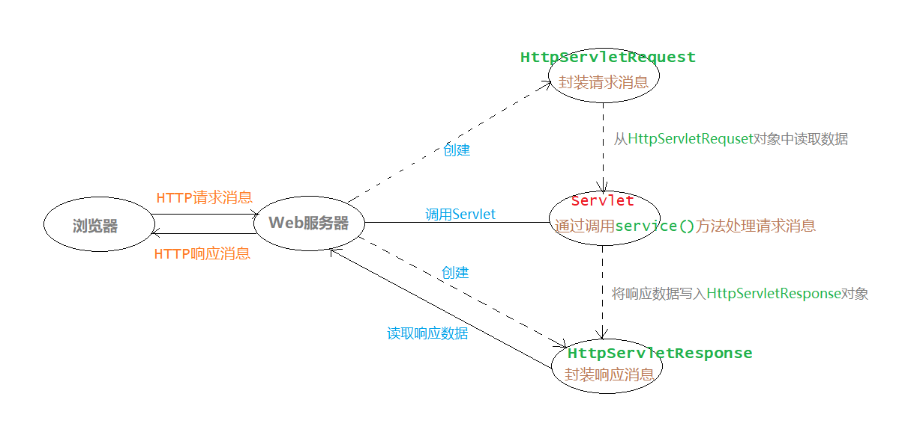

## 学习笔记 : Java web之请求与响应

### 简介
*`Servlet`最主要的作用就是处理客户端请求,并向客户端做出响应.为此,针对Servlet的每次请求,Web服务器在调用`service()`之前,都会创建两个对象,分别是: `HttpServletRequest`和`HttpServletResponse`.其中HttpServletRequest用于封装HTTP请求消息,简称`request`对象.HttpServletResponse用于封装HTTP响应消息,简称`response`对象.下面通过示例图来展示浏览器访问Servlet的交互过程.*




### HttpServletResponse
*HttpServletResponse接口继承自`ServletResponse`,用于封装HTTP响应消息.由于HTTP响应消息分为 : `状态行`,`响应消息头`,`消息体`三部分,因此,在HttpServletResponse接口中定义了向客户端发送响应状态码,响应消息头,响应消息体的方法.*


### HttpServletResponse application

#### 中文输出乱码问题
*由于计算机中的数据都是以二进制形式存储的,因此,当传输文本时,就会发生字符和字节之间的转换.字符与字节之间是通过查码表完成的,将字符转换为字节的过程称为`编码`,相反称为`解码`.如果两者使用的码表不一致就会导致乱码问题.可通过以下示例程序中的方法解决此问题.*
```java
@WebServlet("/SetCharsetServlet")
public class SetCharsetServlet extends HttpServlet {
	private static final long serialVersionUID = 1L;

	public SetCharsetServlet() {
		super();
	}

	protected void doGet(HttpServletRequest request, HttpServletResponse response)
			throws ServletException, IOException {

		// 第一种解决乱码的方式
		// response.setCharacterEncoding("utf-8");
		// response.setHeader("Content-Type", "text/html;charset=utf-8");

		// 第二种解决乱码的方式
		response.setContentType("text/html;charset=utf-8");

		PrintWriter printWriter = response.getWriter();
		printWriter.write("中文");
	}

	protected void doPost(HttpServletRequest request, HttpServletResponse response)
			throws ServletException, IOException {
		doGet(request, response);
	}

}
```

#### 网页定时刷新并跳转
*在HTTP中定义了一个`Refresh`头字段,他可以通知浏览器在指定的时间自动刷新并跳转到其它页面.示例程序如下.*
```java
@WebServlet("/SetHeaderServlet")
public class SetHeaderServlet extends HttpServlet {
	private static final long serialVersionUID = 1L;

	public SetHeaderServlet() {
		super();
	}

	protected void doGet(HttpServletRequest request, HttpServletResponse response)
			throws ServletException, IOException {

		// 实现网页的定时刷新并跳转
		response.setHeader("Refresh","5;URL=https://yubuntu0109.github.io");

	}

	protected void doPost(HttpServletRequest request, HttpServletResponse response)
			throws ServletException, IOException {
		doGet(request, response);
	}

}
```

#### 请求重定向
*在某些情况下,针对客户端的请求,一个`Servlet`类可能无法完成全部工作.这时,可以使用请求重定向来完成.所谓的请求重定向,指的是Web服务器接受到客户端的请求后,可能由于某些条件限制,不能访问当前请求URL所指的Web资源,而是指定了一个新的资源路径,让客端户重新发送请求.*

1. *用户登录界面*
```html
<%@ page language="java" contentType="text/html; charset=UTF-8"
    pageEncoding="UTF-8"%>
<!DOCTYPE html>
<html>
	<head>
		<meta charset="UTF-8">
		<title>login in</title>
	</head>
	<body>
		<h3 align="center">User login interface</h3>
		<hr>
		<div align="center">
			<form action="SendRedirectTest" method="post">
				<table>
					<tr>
						<td>User name</td>
						<td><input type="text" name="username"/></td>
					</tr>
					<tr>
						<td>Password</td>
						<td><input type="password" name="userpassword"/></td>
					</tr>
				</table>
			<input type="submit" name="login in"/>
			</form>
		</div>
	</body>
</html>
```

2. *登录成功页面*
```html
<%@ page language="java" contentType="text/html; charset=UTF-8"
    pageEncoding="UTF-8"%>
<!DOCTYPE html>
<html>
	<head>
		<meta charset="UTF-8">
		<title>success</title>
	</head>
	<body>
		<h3 align="center" >weclome</h3>
		<hr>
		<p align="center">success to login in !</p>
	</body>
</html>
```

3. *编写处理用户登录请求的Servlet程序*
```java
@WebServlet("/SendRedirectServlet")
public class SendRedirectServlet extends HttpServlet {
	private static final long serialVersionUID = 1L;

	public SendRedirectServlet() {
		super();
	}

	protected void doGet(HttpServletRequest request, HttpServletResponse response)
			throws ServletException, IOException {

		// 设置编码
		response.setContentType("text/html;charset=utf-8");

		// 使用HttpServletRequest对象的getParameter()方法获取用户名及密码
		String name = request.getParameter("username");
		String password = request.getParameter("userpassword");

		if ("YUbuntu0109".equals(name) && "demo".equals(password)) {
			response.sendRedirect("Redirection/welcome.jsp");
		} else {
			response.sendRedirect("login.jsp");
		}
	}

	protected void doPost(HttpServletRequest request, HttpServletResponse response)
			throws ServletException, IOException {
		doGet(request, response);
	}

}
```


### HttpServletRequest
*HttpServletRequest接口继承自`ServletRequest`,用于封装HTTP请求消息.由于HTTP请求消息分为 : `请求行`,`请求消息头`,`请求消息体`三部分,因此,在HttpServletRequest接口中定义了获取请求行,请求头,请求消息体的相关方法.*


### HttpServletRequest application

#### 利用Referer请求头防止盗链
*编写一个Servlet类,其负责提供下载内容,但它要求下载请求的链接必须是通过本网站进入的,否则,会将请求转发给下载说明的HTML页面.*
```java
/**
 * @ClassName: DownManagerServlet
 * @Description: 利用`Referer`请求头防止盗链
 * @author: HuangYuhui
 * @date: Apr 29, 2019 9:41:11 AM
 *
 */
@WebServlet("/DownManagerServlet")
public class DownManagerServlet extends HttpServlet {
	private static final long serialVersionUID = 1L;

	public DownManagerServlet() {
		super();
	}

	protected void doGet(HttpServletRequest request, HttpServletResponse response)
			throws ServletException, IOException {

		response.setContentType("text/html;charset=utf-8");
		PrintWriter printWriter = response.getWriter();

        // 获取referer头的值: http://localhost:8080/Request-Response_basic/DownManagerServlet
		String referer = request.getHeader("referer");

        // 获取访问地址
		// 由于第一次请求DownManagerServlet时,请求消息中并不包含referer请求头,
		// 所以DownManagerServlet会将下载请求转发给了downlaod.html页面
		String sitePart = "http://" + request.getServerName();

		if (referer != null && referer.startsWith(sitePart)) {
			printWriter.println("dealing download ...");
		} else {

			// 非法下载请求将跳转到download.html页面
			request.getRequestDispatcher("HttpServletRequest/download.html").forward(request, response);
		}

	}

	protected void doPost(HttpServletRequest request, HttpServletResponse response)
			throws ServletException, IOException {
		doGet(request, response);
	}

}
```

#### 请求参数的中文乱码问题
*HttpServletRequest接口中,提供了一个`setCharacterEncoding()`方法,该方法用于设置request对象的解码方式.但该方法只对`POST`提交方式有效(`错误结论`),为了解决`GET`方式提交表单的中文乱码问题,可以首先使用`ISO 8859-1`将用户名重新编码,然后使用码表GBK进行解码.示例程序略..*


### RequestDispatcher
*当一个Web资源收到客户端的请求后,如果希望服务器通知另外一个资源去处理请求,这时,除了使用`sendRedirect()`方法实现请求重定向外,还可以通过`RequestDispatcher`接口的实例对象来实现.在`ServletRequest`接口中定义了一个获取RequestDispatcher对象的方法.*

1. *获取RequestDispatcher对象的方法*
```java
// 返回封装了某个路径所指资源的RequestDispather对象.其中,参数path必须
// 以'/'开头,用于表示当前Web应用的根目录
getRequestDispatcher(String path);
```

2. *获取RequestDispatcher对象后,最重要的工作是通知其他Web资源处理当前的Servlet请求,为此,在RequestDispather接口中,定义了两个相关的方法*
```java
// 该方法用于将请求从一个Servlet传递给另外的一个Web资源(请求转发)
// 注意: 该方法必须在响应提交给客户端之前被调用,否则抛出IllegalStateException
forward(ServletRequests request,ServletResponse response);

// 该方法用于将其他的资源作为当前响应内容包含进来
include(ServletRequest request,ServletResponse response);
``` 

### RequestDispatcher applicatoin

#### forward()实现请求转发
*通过使用`forward()`方法,将当前RequestForwardServlet的请求转发到ResultServlet页面*

1. *RequestForwardServlet示例程序*
```java
/**
 * @ClassName: RequestForwardServlet
 * @Description: 请求转发:forword()
 * @author: HuangYuhui
 * @date: Apr 29, 2019 11:07:03 AM
 *
 */
@WebServlet("/RequestForwardServlet")
public class RequestForwardServlet extends HttpServlet {
	private static final long serialVersionUID = 1L;

	public RequestForwardServlet() {
		super();
	}

	protected void doGet(HttpServletRequest request, HttpServletResponse response)
			throws ServletException, IOException {

		response.setContentType("text/html;charset=utf-8");
		request.setAttribute("websiteURL", "https://yubuntu0109.github.io");
		// request.getRequestDispatcher("/ResultServlet").forward(request, response);
		RequestDispatcher requestDispatcher = request.getRequestDispatcher("/ResultServlet");
		requestDispatcher.forward(request, response);

	}

	protected void doPost(HttpServletRequest request, HttpServletResponse response)
			throws ServletException, IOException {
		doGet(request, response);
	}

}
```
2. *ResultServlet示例程序*
```java
/**
 * @ClassName: ResultServlet
 * @Description: 请求转发:forword()
 * @author: HuangYuhui
 * @date: Apr 29, 2019 11:12:47 AM
 *
 */
@WebServlet("/ResultServlet")
public class ResultServlet extends HttpServlet {
	private static final long serialVersionUID = 1L;

	public ResultServlet() {
		super();
	}

	protected void doGet(HttpServletRequest request, HttpServletResponse response)
			throws ServletException, IOException {

		response.setContentType("text/html;charset=utf-8");
		response.getWriter().println("<p align='center'>" + "my personal blog website address : "
				+ request.getAttribute("websiteURL") + "</p>");
	}

	protected void doPost(HttpServletRequest request, HttpServletResponse response)
			throws ServletException, IOException {
		doGet(request, response);
	}

}
```
3. *页面显示结果*
```
my personal blog website address : https://yubuntu0109.github.io
```
*由结果可知,`forward()`方法不仅可以实现请求转发,还可以使转发页面和转发到的页面共享数据.需要注意的是: `存储在request对象中的数据只对当前请求有效,而对其他请求无效.`*

#### include()实现请求包含
*请求包含指的是使用`include`方法将Servlet请求转发给其他Web资源进行处理,与请求转发不同的是,在请求包含返回的响应消息中,既包含当前Servlet的响应消息也包含其他Web资源所做出的响应消息.*

1. *编写IncludingServlet程序,其中调用`include()`方法请求包含IncludedServlet程序.*
```java
/**
 * @ClassName: IncludingServlet
 * @Description: 请求包含:include() 
 * @author: HuangYuhui
 * @date: Apr 29, 2019 11:28:25 AM
 *
 */
@WebServlet("/IncludingServlet")
public class IncludingServlet extends HttpServlet {
	private static final long serialVersionUID = 1L;

	public IncludingServlet() {
		super();
	}

	protected void doGet(HttpServletRequest request, HttpServletResponse response)
			throws ServletException, IOException {

		// 因为请求IncludingServelt时,用于封装响应消息的HttpServletResponse对象已经创建,该对象在编码时采用的是默认的: ISO 8859-1
		// 所以当客户端对接收到的数据进行解码时,Web服务器会继续保持调用HttpServeltResponse对象中的信息,从而使IncludedServlet中
		// 的输出内容发生乱码.为解决此问题需在IncludingServlet中提前设置如下编码方式 .
		response.setContentType("text/html;charset=utf-8");

		RequestDispatcher resDispatcher = request.getRequestDispatcher("/IncludedServelt?name=YUbuntu0109");
		resDispatcher.include(request, response);
	}

	protected void doPost(HttpServletRequest request, HttpServletResponse response)
			throws ServletException, IOException {
		doGet(request, response);
	}

}
```

2. *IncludedServlet程序*
```java
/**
 * @ClassName: IncludedServlet
 * @Description: 请求包含:include()
 * @author: HuangYuhui
 * @date: Apr 29, 2019 11:33:42 AM
 *
 */
@WebServlet("/IncludedServelt")
public class IncludedServlet extends HttpServlet {
	private static final long serialVersionUID = 1L;

	public IncludedServlet() {
		super();
	}

	protected void doGet(HttpServletRequest request, HttpServletResponse response)
			throws ServletException, IOException {
		response.setContentType("text/html;charset=utf-8");
		PrintWriter printWriter = response.getWriter();
		printWriter.println("中文<br>");
		printWriter.println("user name : " + request.getParameter("name") + "<br>");
		printWriter.println("request.getRequestURI() : " + request.getRequestURI());
	}

	protected void doPost(HttpServletRequest request, HttpServletResponse response)
			throws ServletException, IOException {
		doGet(request, response);
	}

}
```

3. *页面显示结果*
```
中文
user name : YUbuntu0109
request.getRequestURI() : /Request-Response_basic/IncludingServlet
```
*注意: 使用`forward()`实现请求转发或使用`include()`方法实现请求包含后,浏览器显示的`URL`地址是不会变化的 !*