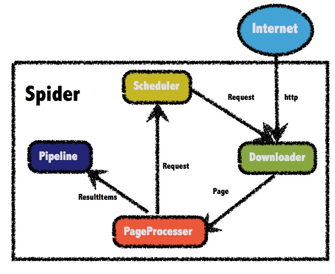

## 学习笔记 :  Java爬虫之WebMagic
*简介 : `WebMagic`是一款简单灵活的爬虫框架,WebMagic的结构分为`Downloader`、`PageProcessor`、`Scheduler`、`Pipeline`四大组件,并由Spider将它们彼此组织起来. 这四大组件对应爬虫生命周期中的下载、处理、管理和持久化等功能. 而`Spider`则将这几个组件组织起来，让它们可以互相交互，流程化的执行，可以认为Spider是一个大的容器，它也是WebMagic逻辑的核心. Little book of WebMagic : http://webmagic.io/docs/zh/*

*WebMagic总体架构图如下所示 :*




### WebMagic的四个组件
#### Downloader 
*Downloader负责从互联网上下载页面,以便后续处理. WebMagic默认使用了`Apache HttpClient`作为下载工具*

#### PageProcessor 
*PageProcessor负责解析页面,抽取有用信息,以及发现新的链接,WebMagic使用`Jsoup`作为HTML解析工具,并基于其开发了解析`XPath`的工具`Xsoup`. 注意 : 在这四个组件中,PageProcessor对于每个站点每个页面都不一样,是需要使用者定制的部分 .*

#### Scheduler
*Scheduler负责管理待抓取的URL,以及一些去重的工作. WebMagic默认提供了`JDK的内存队列`来管理URL,并用集合来进行去重. 也支持使用Redis进行分布式管理 .*

#### Pipeline
*Pipeline负责抽取结果的处理,包括计算、持久化到文件、数据库等.. WebMagic默认提供了`输出到控制台`和`保存到文件`两种结果处理方案. Pipeline定义了结果保存的方式,如果你要保存到指定数据库,则需要编写对应的Pipeline. 对于一类需求一般只需编写一个Pipeline .*


### 用于数据流转的对象
#### Request
*`Request`是对URL地址的一层封装,一个Request对应一个URL地址. 它是PageProcessor与Downloader交互的载体,也是PageProcessor控制Downloader唯一方式. 除了URL本身外,它还包含一个`Key-Value`结构的字段`extra`. 你可以在extra中保存一些特殊的属性,然后在其他地方读取,以完成不同的功能。例如附加上一个页面的一些信息等 .*

#### Page
*Page代表了从Downloader下载到的一个页面——可能是HTML,也可能是JSON或者其他文本格式的内容. `Page为WebMagic抽取过程的核心对象`,它提供一些方法可供抽取、结果保存等 ..*

#### ResultItems
*ResultItems相当于一个`Map`,它保存PageProcessor处理的结果,供Pipeline使用. 它的API与Map很类似,值得注意的是它有一个字段`skip`,若设置为true,则不应被Pipeline处理 .*


### 控制爬虫运转的引擎-Spider
*`Spider`是WebMagic内部流程的核心. `Downloader`、`PageProcessor`、`Scheduler`、`Pipeline`都是Spider的一个属性,这些属性是可以自由设置的,通过设置这个属性可以实现不同的功能. Spider也是WebMagic操作的入口,它封装了爬虫的创建、启动、停止、多线程等功能 .. 注意 : 一般来说,对于编写一个爬虫,PageProcessor是需要编写的部分,而Spider则是创建和控制爬虫的入口哟 ~*


### WebMagic入门程序
*获取我博客中的个人姓名信息,示例程序如下 :*
```java
package pers.huangyuhui.crawler.WebMagic_Demo;

import us.codecraft.webmagic.Page;
import us.codecraft.webmagic.Site;
import us.codecraft.webmagic.Spider;
import us.codecraft.webmagic.processor.PageProcessor;

/**
 * @project: crawler_learning
 * @description: 第一个WebMagic小爬虫:爬取博客中的个人姓名
 * @author: 黄宇辉
 * @date: 7/10/2019-3:54 PM
 * @version: 1.0
 * @website: https://yubuntu0109.github.io/
 */
public class FirstDemo implements PageProcessor {

    //可以对爬虫进行一些配置,包括编码,抓取间隔,超时时间,重试次数等..
    private Site site = Site.me();

    @Override
    public void process(Page page) {
        //解析Page,并将其结果存放到ResultItem中
        page.putField("name", page.getHtml().css("aside#menu hgroup.introduce h5", "text"));
        System.out.println(page.getResultItems().toString());
    }

    @Override
    public Site getSite() {
        return site;
    }

    //WebMagic默认将爬取结果输出到控制台
    public static void main(String[] args) {
        Spider.create(new FirstDemo())
                .addUrl("https://yubuntu0109.github.io/")
                .run();
    }
}
```

*程序运行结果 :*
```
19-07-13 15:58:11,084 INFO  us.codecraft.webmagic.Spider(Spider.java:306) ## Spider yubuntu0109.github.io started!

19-07-13 15:58:12,210 INFO  us.codecraft.webmagic.downloader.HttpClientDownloader(HttpClientDownloader.java:86) ## downloading page success https://yubuntu0109.github.io/

ResultItems{fields={name=黄宇辉}, request=Request{url='https://yubuntu0109.github.io/', method='null', extras=null, priority=0, headers={}, cookies={}}, skip=false}
get page: https://yubuntu0109.github.io/

name:	黄宇辉      <----------WebMagic默认将爬取结果输出到控制台

19-07-13 15:58:17,405 INFO  us.codecraft.webmagic.Spider(Spider.java:338) ## Spider yubuntu0109.github.io closed! 1 pages downloaded.

Process finished with exit code 0
```


### WebMagic抽取元素功能
*`CSS` : 爬取博客个人姓名信息的元素标签*
```java
page.putField("name", page.getHtml().css("aside#menu hgroup.introduce h5"));
```
*程序运行结果 :*
```
name:	<h5 class="nickname">黄宇辉</h5>
```

*`CSS` : 爬取博客个人姓名信息*
```java
page.putField("name", page.getHtml().css("aside#menu hgroup.introduce h5", "text"));
```
*程序运行结果 :*
```
name:	黄宇辉
```

*`CSS` : 爬取博客首页所有文章标题*
```java
page.putField("title", page.getHtml().css("div.container h3 a", "text").all());
```
*程序运行结果 :*
```
title:	
[
    Java爬虫之Jsoup, 
    Java爬虫之HttpClient,
    Spring-Boot拥抱MyBatis及Redis ~, 
    Spring Boot之文件上传与下载,
    Spring Boot项目:好友备忘录, 
    Spring Boot之Thymeleaf, 
    Spring Boot之整合视图层技术, 
    Spring Boot之基本Web开发, 
    Hi Redis ~, 
    Hi Spring Boot ~
]
```

---


*`XPath` : 爬取博客首页所有文章标题的元素标签*
```java
page.putField("title", page.getHtml().xpath("//div[@class=container]/ul/li/article/h3/a").all());
```
*程序运行结果 :*
```java
title:	
[
    <a class="post-title-link" href="/2019/07/10/Java爬虫之Jsoup/">Java爬虫之Jsoup</a>, 
    <a class="post-title-link" href="/2019/07/10/Java爬虫之HttpClient/">Java爬虫之HttpClient</a>, 
    <a class="post-title-link" href="/2019/07/01/Spring-Boot拥抱MyBatis及Redis/">Spring-Boot拥抱MyBatis及Redis ~</a>, 
    <a class="post-title-link" href="/2019/06/30/Spring-Boot之文件上传/">Spring Boot之文件上传与下载</a>, 
    <a class="post-title-link" href="/2019/06/30/Spring-Boot项目-好友备忘录/">Spring Boot项目:好友备忘录</a>, 
    <a class="post-title-link" href="/2019/06/27/Spring-Boot之Thymeleaf/">Spring Boot之Thymeleaf</a>, 
    <a class="post-title-link" href="/2019/06/26/Spring-Boot之整合视图层技术/">Spring Boot之整合视图层技术</a>, 
    <a class="post-title-link" href="/2019/06/26/Spring-Boot之基本Web开发/">Spring Boot之基本Web开发</a>, 
    <a class="post-title-link" href="/2019/06/25/Hi-Redis/">Hi Redis ~</a>, 
    <a class="post-title-link" href="/2019/06/23/Hi-Spring-Boot/">Hi Spring Boot ~</a>
]
```

---


*`Regex` : 爬取博客首页含'Java'关键字的文章标题*
```java
page.putField("title", page.getHtml().css("div.container h3 a", "text").regex(".*Java.*").all());
```
*程序运行结果 :*
```
title:	[Java爬虫之Jsoup, Java爬虫之HttpClient]
```

---


*`Link` : 爬取博客首页含'Java'关键字的文章链接*
```java
//获取博客首页中包含'Hi'关键字的文章链接
page.addTargetRequests(page.getHtml().css("div.container h3 a").links().regex(".*Hi.*").all());
//根据文章链接获取该文章标题
page.putField("blog-title", page.getHtml().css("div.post-content h2", "text").all());
```
*程序运行结果 :*
```
19-07-13 16:52:15,233 INFO  us.codecraft.webmagic.downloader.HttpClientDownloader(HttpClientDownloader.java:86) 
## downloading page success https://yubuntu0109.github.io/2019/06/25/Hi-Redis/
get page: https://yubuntu0109.github.io/2019/06/25/Hi-Redis/
blog-title:	[学习笔记 : 拥抱Redis ~]

19-07-13 16:52:20,490 INFO  us.codecraft.webmagic.downloader.HttpClientDownloader(HttpClientDownloader.java:86) 
## downloading page success https://yubuntu0109.github.io/2019/06/23/Hi-Spring-Boot/
get page: https://yubuntu0109.github.io/2019/06/23/Hi-Spring-Boot/
blog-title:	[学习笔记 : 拥抱Spring Boot]
```

---


### WebMagic自定义配置
*对爬虫进行一些配置*
```java
private static Site site = Site.me()
        .setCharset("utf-8")//字符编码
        .setTimeOut(10000)//超时时间-10s
        .setRetrySleepTime(2000)//重试间隔时间-2s
        .setRetryTimes(5);//重试次数
```

*将爬取的数据存储到指定文件夹中*
```java
Spider.create(new PipelineDemo()).addPipeline(new FilePipeline("D:\\WebMagic-Pipeline-Demo\\Data\\")) ..
```

*设置处理爬虫的线程数*
```java
Spider.create(new ThreadDemo()).thread(5)..
```