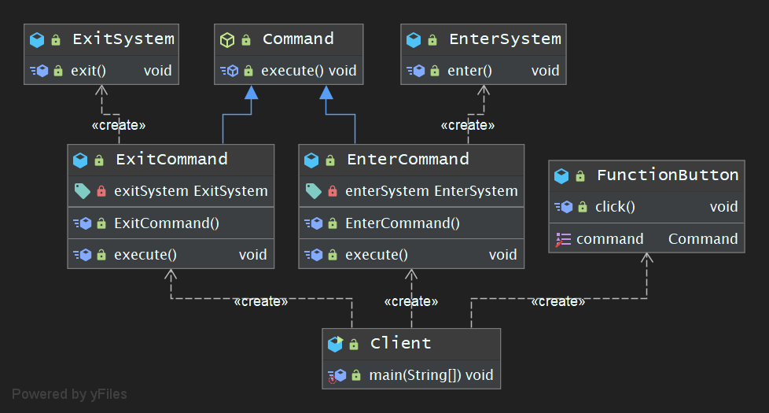
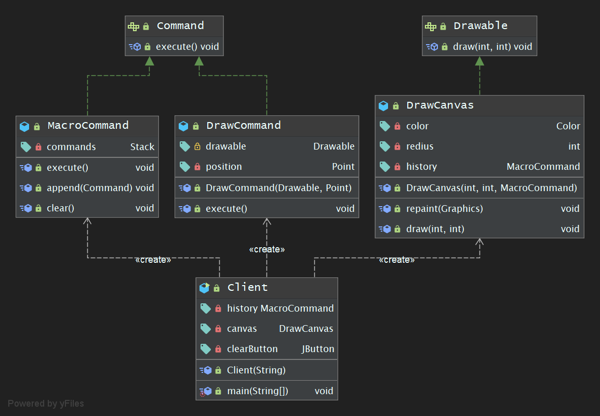

## 学习笔记 : Java设计模式之Command Pattern

### 定义
*命令模式 : 将一个请求封装为一个对象,从而可用不同的请求对客户进行参数化,对请求排队或者记录请求日志,以及支持可撤销的操作. ( Command Pattern : Encapsulate a request as an object, thereby letting you parameterize clients with different requests, queue or log requests, and undoable operations )*

* 扩 : 命令模式是一种对象行为型模式,其别名为动作( Action )模式或事物( Transaction )模式. 命令模式是常用的行为型模式之一,它将请求发送者与请求接收者`解耦`,请求发送者通过命令对象来间接引用接受者,使得系统具有更好的灵活性,可以在不修改现有系统源码代码的情况下让相同的发送者对应不同的接受者.


### 角色分析
1. *`Command( 抽象命令类 )` : 抽象命令类一般是一个抽象接类或接口,在其中声明了用于执行请求的 execute() 等方法,通过这些方法可以调用`请求接收者`的相关操作.*
2. *`ConcreteCommand( 具体命令类 )` : 具体命令类是`抽象命令类`的子类,实现了在抽象命令类中声明的方法,它对应具体的`接收者`对象,将接收者对象的动作绑定其中. 具体命令类在实现 execute() 方法时将调用`接收者`对象的相关操作.*
3. *`Invoker( 调用者 )` : 调用者既请求发送者,它通过命令对象来执行请求. 一个调用者并不需要在设计时确定其接收者,因此它只与抽象命令类之间存在关联关系. 在程序运行时可以将一个具体命令对象注入其中,再调用具体命令对象的 execute() 方法,从而实现间接调用`请求接收者`的相关操作.*
4. *`Receiver( 接收者 )` : 接收者执行与请求相关的操作,具体实现对请求业务的处理.*


### 示例程序-1
*下面是一个使用命令设计模式的简单程序案例,案例说明 : 某系统提供了一系列功能键,用户可以自定义功能键( FunctionButton )的功能,例如登录键( LoginInCommand )用于登录系统,退出键( LoginOutCommand )用于注销系统 · · ·*

1. *FunctionButton类 : 功能键类, 充当请求调用者(请求发送者)*
```java
package pers.huangyuhui.command_pattern.command_pattern_1;

/**
 * @project: design-patterns
 * @description: 功能键类, 充当请求调用者(请求发送者)
 * @author: 黄宇辉
 * @date: 9/20/2019-8:59 PM
 * @version: 1.0
 * @website: https://yubuntu0109.github.io/
 */
public class FunctionButton {

    private Command command;

    //为功能键注入命令
    public void setCommand(Command command) {
        this.command = command;
    }

    //发送请求的方法
    public void click() {
        command.execute();
    }

}
```

2. *Command抽象类 : 抽象命令类*
```java
package pers.huangyuhui.command_pattern.command_pattern_1;

/**
 * @project: design-patterns
 * @description: 抽象命令类
 * @author: 黄宇辉
 * @date: 9/20/2019-9:01 PM
 * @version: 1.0
 * @website: https://yubuntu0109.github.io/
 */
public abstract class Command {
    public abstract void execute();
}
```

3. *LoginInCommand类 : 登录命令类, 充当具体命令类*
```java
package pers.huangyuhui.command_pattern.command_pattern_1;

/**
 * @project: design-patterns
 * @description: 登录命令类, 充当具体命令类
 * @author: 黄宇辉
 * @date: 9/20/2019-9:07 PM
 * @version: 1.0
 * @website: https://yubuntu0109.github.io/
 */
public class LoginInCommand extends Command {

    private LoginInSystem enterSystem;

    public LoginInCommand() {
        this.enterSystem = new LoginInSystem();
    }

    //命令执行方法,将调用请求接收者的业务方法
    @Override
    public void execute() {
        enterSystem.login();
    }
}
```

4. *LoginOutCommand类 : 退出命令类, 充当具体命令类*
```java
package pers.huangyuhui.command_pattern.command_pattern_1;

/**
 * @project: design-patterns
 * @description: 退出命令类, 充当具体命令类
 * @author: 黄宇辉
 * @date: 9/20/2019-9:05 PM
 * @version: 1.0
 * @website: https://yubuntu0109.github.io/
 */
public class LoginOutCommand extends Command {

    private LoginOutSystem exitSystem;

    public LoginOutCommand() {
        this.exitSystem = new LoginOutSystem();
    }

    //命令执行方法,将调用请求接受者的业务方法
    @Override
    public void execute() {
        exitSystem.exit();
    }
}
```

5. *LoginInSystem类 : 登录系统的模拟实现类, 充当请求接收者*
```java
package pers.huangyuhui.command_pattern.command_pattern_1;

/**
 * @project: design-patterns
 * @description: 登录系统的模拟实现类, 充当请求接收者
 * @author: 黄宇辉
 * @date: 9/20/2019-9:10 PM
 * @version: 1.0
 * @website: https://yubuntu0109.github.io/
 */
public class LoginInSystem {

    public void login() {
        System.out.println("login in");
    }
}
```

6. *LoginOutSystem类 : 退出系统的模拟实现类, 充当请求接收者*
```java
package pers.huangyuhui.command_pattern.command_pattern_1;

/**
 * @project: design-patterns
 * @description: 退出系统的模拟实现类, 充当请求接收者
 * @author: 黄宇辉
 * @date: 9/20/2019-9:08 PM
 * @version: 1.0
 * @website: https://yubuntu0109.github.io/
 */
public class LoginOutSystem {

    public void exit() {
        System.out.println("login out");
    }
}
```

7. *Client类 : 客户端测试类*
```java
package pers.huangyuhui.command_pattern.command_pattern_1;

/**
 * @project: design-patterns
 * @description: 客户端测试类
 * @author: 黄宇辉
 * @date: 9/20/2019-9:11 PM
 * @version: 1.0
 * @website: https://yubuntu0109.github.io/
 */
public class Client {

    public static void main(String[] args) {
        FunctionButton functionButton = new FunctionButton();
        Command login_key = new LoginInCommand();
        functionButton.setCommand(login_key);
        functionButton.click();

        System.out.println("--------------------");

        Command exit_key = new LoginOutCommand();
        functionButton.setCommand(exit_key);
        functionButton.click();
    }
}
```

8. *示例程序运行的结果如下所示 :*
```
login in
--------------------
login out
```

#### 示例程序的类图



### 示例程序-2
*下面是一个使用命令设计模式的简单程序案例,案例说明 : 设计一个画图软件,既用户可以通过拖动鼠标在画板上画画,点击 clear 按钮时会擦除画板上的痕迹.*

1. *Command接口 : 表示"命令"的接口,充当(抽象)命令*
```java
package pers.huangyuhui.command_pattern.command_pattern_2;

/**
 * @project: design-patterns
 * @description: 表示"命令"的接口,充当(抽象)命令
 * @author: 黄宇辉
 * @date: 9/20/2019-9:25 PM
 * @version: 1.0
 * @website: https://yubuntu0109.github.io/
 */
public interface Command {
    void execute();
}
```

2. *MacroCommand类 : 表示"由多条命令整合成的命令"的类,充当具体的命令*
```java
package pers.huangyuhui.command_pattern.command_pattern_2;

import java.util.Stack;

/**
 * @project: design-patterns
 * @description: 表示"由多条命令整合成的命令"的类,充当具体的命令
 * @author: 黄宇辉
 * @date: 9/20/2019-9:27 PM
 * @version: 1.0
 * @website: https://yubuntu0109.github.io/
 */
public class MacroCommand implements Command {

    //命令的集合
    private Stack commands = new Stack();

    //执行命令
    @Override
    public void execute() {
        for (Object command : commands) {
            ((Command) command).execute();
        }
    }

    //添加命令
    public void append(Command command) {
        if (command != this) {
            commands.push(command);
        }
    }

    //清除命令
    public void clear() {
        commands.clear();
    }

}
```

3. *DrawCommand类 : 表示"绘制一个点的命令( 画笔 )"的类,充当具体的命令*
```java
package pers.huangyuhui.command_pattern.command_pattern_2;

import java.awt.*;

/**
 * @project: design-patterns
 * @description: 表示"绘制一个点的命令"的类,充当具体的命令
 * @author: 黄宇辉
 * @date: 9/20/2019-9:33 PM
 * @version: 1.0
 * @website: https://yubuntu0109.github.io/
 */
public class DrawCommand implements Command {

    //绘制对象
    protected Drawable drawable;

    //绘制位置
    private Point position;

    //构造函数
    public DrawCommand(Drawable drawable, Point position) {
        this.drawable = drawable;
        this.position = position;
    }

    //执行命令
    @Override
    public void execute() {
        drawable.draw(position.x, position.y);
    }

}
```

4. *Drawable接口 : 表示"绘制对象"的接口*
```java
package pers.huangyuhui.command_pattern.command_pattern_2;

/**
 * @project: design-patterns
 * @description: 表示"绘制对象"的接口
 * @author: 黄宇辉
 * @date: 9/20/2019-9:37 PM
 * @version: 1.0
 * @website: https://yubuntu0109.github.io/
 */
public interface Drawable {
    void draw(int x, int y);
}
```

5. *DrawCanvas类 : 实现"绘制对象"的类,充当接收者*
```java
package pers.huangyuhui.command_pattern.command_pattern_2;

import java.awt.*;

/**
 * @project: design-patterns
 * @description: 实现"绘制对象"的类,充当接收者
 * @author: 黄宇辉
 * @date: 9/20/2019-9:39 PM
 * @version: 1.0
 * @website: https://yubuntu0109.github.io/
 */
public class DrawCanvas extends Canvas implements Drawable {

    //颜色
    private Color color = Color.green;
    //要绘制的圆点半径
    private int redius = 5;
    //命令的历史记录
    private MacroCommand history;

    //构造函数
    public DrawCanvas(int width, int height, MacroCommand history) {
        this.setSize(width, height);
        this.setBackground(Color.white);
        this.history = history;
    }

    //重新全部绘制
    public void repaint(Graphics graphics) {
        history.execute();
    }

    //绘制
    @Override
    public void draw(int x, int y) {
        Graphics graphics = getGraphics();
        graphics.setColor(color);
        graphics.fillOval(x - redius, y - redius, redius * 2, redius * 2);
    }
}
```

6. *Client类 : 客户端测试类*
```java
package pers.huangyuhui.command_pattern.command_pattern_2;

import javax.swing.*;
import java.awt.*;
import java.awt.event.MouseEvent;
import java.awt.event.MouseMotionAdapter;

/**
 * @project: design-patterns
 * @description: 客户端测试类
 * @author: 黄宇辉
 * @date: 9/20/2019-9:48 PM
 * @version: 1.0
 * @website: https://yubuntu0109.github.io/
 */
public class Client extends JFrame {

    //绘制的历史记录
    private MacroCommand history = new MacroCommand();
    //绘制区域(设置画板大小)
    private DrawCanvas canvas = new DrawCanvas(600, 400, history);
    //删除按钮
    private JButton clearButton = new JButton("clear");

    public Client(String title) {
        super(title);

        /*
        鼠标拖动事件
         */
        canvas.addMouseMotionListener(new MouseMotionAdapter() {
            @Override
            public void mouseDragged(MouseEvent e) {
                Command command = new DrawCommand(canvas, e.getPoint());
                history.append(command);
                command.execute();
            }
        });

        /*
        动作监听事件
         */
        clearButton.addActionListener(e -> {
            if (e.getSource() == clearButton) {
                history.clear();
                canvas.repaint();
            }
        });

        /*
        JFrame面板配置
         */
        setLayout(new BorderLayout());
        add(clearButton, BorderLayout.NORTH);
        add(canvas, BorderLayout.SOUTH);
        setDefaultCloseOperation(JFrame.EXIT_ON_CLOSE);
        pack();
        setVisible(true);
    }

    public static void main(String[] args) {
        new Client("a simple drawing board");
    }

}
```

7. *示例程序的运行结果如下图所示 :*


#### 示例程序的类图
