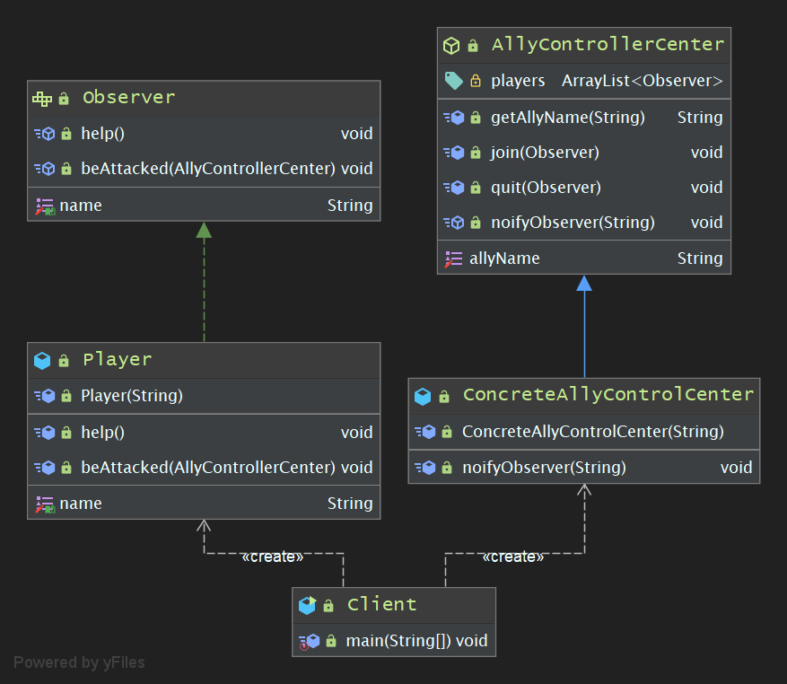

## 学习笔记 : Java设计模式之Observer Pattern

### 定义
*观察者设计模式 : 定义对象之间的一种一对多的依赖关系,使得每当一个对象状态发生改变时其相关依赖对象皆得到通知并被自动更新. ( Observer Pattern : Define a one-to-many dependency between objects so that when one object changes state, all its dependents are notified and updated automatically )*

### 概述
*观察者模式的别名有发布-订阅( Publish-Subscribe )模式,模型-视图( Model-View )模式,源-监听器( Source-Listener )模式,从属者( Dependents )模式. 观察者模式是一种对象行为模式. 其用于描述对象之间的依赖关系,为实现多个对象之间的联动提供了一种解决方案,是一种对象行为型模式.*

### 角色分析
1. *`Subject( 目标 )` : 目标又称为主题,它是指被观察的对象. 在目标中定义了一个观察者集合,一个观察者目标可以接收任意数量的观察者来观察,它提供了一系列方法来增加和删除观察者对象,同时它定义了通知方法 notify(). 目标类可以是接口,也可以是抽象类或具体类.*
2. *`ConcreteSubject( 具体目标 )` : 具体目标是目标类的子类,它通常包含有经常方法改变的数据,当它的状态发生改变时将向它的各个观察者发出通知,同时还可以实现了在目标类中定义的抽象业务逻辑方法. 如果无需扩展目标类,则具体目标类可以省略.*
3. *`Observer( 观察者 )` : 观察者将对观察目标的改变做出反应,观察者一般定义为接口,该接口声明了更新数据的 update() 方法,因此又称为抽象观察者.*
4. *`ConcreteObserver( 具体观察者 )` : 在具体观察者中维护了一个指向具体目标对象的引用,它存储具体观察者的有关状态,这些状态需要和目标的状态保持一致. 它实现了在抽象观察者 Observer 中定义的 update() 方法. 通常在实现时可以调用具体目标类的 attach() 方法将自己添加到目标类的集合中或通过 detach() 方法将自己从目标类的集合中删除.*

### 示例程序
*下面是一个使用观察者设计模式的简单示例程序,模拟功能 : 在某多人联机对战游戏中,多个玩家可以加入同一战队组成联盟,当战队中的某一成员被敌人攻击时,其可以向其它队友发送求救通知,队友接收通知后作出相应的反应,既而来实现战队成员之间的联动~*

1. *AllyControllerCenter抽象类 : 指挥部(战队控制中心)类, 充当抽象目标类*
```java
package pers.huangyuhui.observer_pattern.observer_pattern_1;

import java.util.ArrayList;

/**
 * @project: design-patterns
 * @description: 指挥部(战队控制中心)类, 充当抽象目标类
 * @author: 黄宇辉
 * @date: 9/29/2019-12:02 PM
 * @version: 1.0
 * @website: https://yubuntu0109.github.io/
 */
public abstract class AllyControllerCenter {

    protected String allyName;

    //定义一个集合用于存储战队成员
    protected ArrayList<Observer> players = new ArrayList<>();

    public void setAllyName(String allyName) {
        this.allyName = allyName;
    }

    public String getAllyName(String allyName) {
        return allyName;
    }

    //注册方法
    public void join(Observer observer) {
        System.out.println("玩家: [ " + observer.getName() + " ]加入战队");
        players.add(observer);
    }

    //注销方法
    public void quit(Observer observer) {
        System.out.println("玩家: [ " + observer.getName() + " ]退出战队");
        players.remove(observer);
    }

    //声明抽象通知方法
    public abstract void noifyObserver(String name);
}
```

2. *ConcreteAllyControlCenter类 : 具体指挥部类, 充当具体目标类*
```java
package pers.huangyuhui.observer_pattern.observer_pattern_1;

/**
 * @project: design-patterns
 * @description: 具体指挥部类, 充当具体目标类
 * @author: 黄宇辉
 * @date: 9/29/2019-12:16 PM
 * @version: 1.0
 * @website: https://yubuntu0109.github.io/
 */
public class ConcreteAllyControlCenter extends AllyControllerCenter {

    public ConcreteAllyControlCenter(String allyName) {
        this.allyName = allyName;
        System.out.println("------ 战队: [ " + allyName + " ]组建成功 ------");
    }

    //实现通知方法
    @Override
    public void noifyObserver(String name) {
        System.out.println("战队: [ " + this.allyName + " ]指挥部发送的紧急通知 : 队友[ " + name + " ]正在遭受敌人攻击");
        //遍历观察者集合,调用每一个队友(除自己)的支援方法
        for (Observer player : players) {
            if (!(player.getName().equalsIgnoreCase(name))) {
                player.help();
            }
        }
    }
}
```

3. *Observer接口 : 抽象观察者类*
```java
package pers.huangyuhui.observer_pattern.observer_pattern_1;

/**
 * @project: design-patterns
 * @description: 抽象观察者类
 * @author: 黄宇辉
 * @date: 9/29/2019-12:05 PM
 * @version: 1.0
 * @website: https://yubuntu0109.github.io/
 */
public interface Observer {

    String getName();

    void setName(String name);

    void help(); //声明支援盟友的方法

    void beAttacked(AllyControllerCenter allyControllerCenter); //声明遭受攻击的方法
}
```

4. *Player类 : 战队成员类, 充当具体观察者类*
```java
package pers.huangyuhui.observer_pattern.observer_pattern_1;

/**
 * @project: design-patterns
 * @description: 战队成员类, 充当具体观察者类
 * @author: 黄宇辉
 * @date: 9/29/2019-12:21 PM
 * @version: 1.0
 * @website: https://yubuntu0109.github.io/
 */
public class Player implements Observer {

    private String name;

    public Player(String name) {
        this.name = name;
    }

    @Override
    public String getName() {
        return name;
    }

    @Override
    public void setName(String name) {
        this.name = name;
    }

    //支援盟友方法的实现
    @Override
    public void help() {
        System.out.println("坚持住! 队友:[ " + this.name + " ]前来支援你");
    }

    //遭受攻击方法的实现,当遭受攻击时将调用战队控制中心类的通知方法noifyObserver()来通知各个盟友
    @Override
    public void beAttacked(AllyControllerCenter allyControllerCenter) {
        System.out.println("队友: [ " + this.name + " ]正在被敌人攻击");
        allyControllerCenter.noifyObserver(name);
    }

}
```

5. *Client类 : 客户端测试类*
```java
package pers.huangyuhui.observer_pattern.observer_pattern_1;

/**
 * @project: design-patterns
 * @description: 客户端测试类
 * @author: 黄宇辉
 * @date: 9/29/2019-12:31 PM
 * @version: 1.0
 * @website: https://yubuntu0109.github.io/
 */
public class Client {

    public static void main(String[] args) {
        //定义观察目标对象
        AllyControllerCenter allyControllerCenter = new ConcreteAllyControlCenter("YU");

        //定义四个观察者对象
        Observer player1, player2, player3, player4;
        player1 = new Player("player-A");
        allyControllerCenter.join(player1);
        player2 = new Player("player-B");
        allyControllerCenter.join(player2);
        player3 = new Player("player-C");
        allyControllerCenter.join(player3);
        player4 = new Player("player-D");
        allyControllerCenter.join(player4);

        //player-A队友遭受敌人攻击
        player1.beAttacked(allyControllerCenter); 

    }
}
```

6. *示例程序的运行结果如下所示 :*
```
------ 战队: [ YU ]组建成功 ------
玩家: [ player-A ]加入战队
玩家: [ player-B ]加入战队
玩家: [ player-C ]加入战队
玩家: [ player-D ]加入战队
队友: [ player-A ]正在被敌人攻击
战队: [ YU ]指挥部发送的紧急通知 : 队友[ player-A ]正在遭受敌人攻击
坚持住! 队友:[ player-B ]前来支援你
坚持住! 队友:[ player-C ]前来支援你
坚持住! 队友:[ player-D ]前来支援你
```

#### 示例程序的类图

