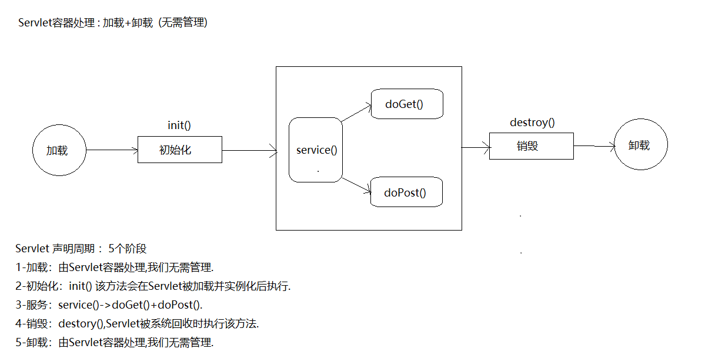

## 学习笔记 ：Java Servlet 的生命周期及其解析

- *Tomcat v9.0 + JDK 11 + Google Chrome*

- *Servlet lifecycle*
- 

### Servlet 2.5 示例

- *JSP program*
```html
<%@ page language="java" contentType="text/html; charset=ISO-8859-1" pageEncoding="ISO-8859-1"%>
<!DOCTYPE html>
<html>
	<head>
		<meta charset="ISO-8859-1">
		<title>Servlet 2.5</title>
	</head>
	<body>
		<a href="ServletLifecyle">doGet : Servlet 3.0</a>
		<!-- 注意: form的默认提交方式为get -->
		<div>
			<form action="ServletLifecyle" method="get"><hr>
				<input type="submit" value="doGet " />
			</form>
			<form action="ServletLifecyle" method="post"><br>
				<input type="submit" value="doPost" />
			</form>
		</div>
	</body>
</html>
```

- *Servlet program*
```java
public class ServletLifecyle extends HttpServlet {
	
	
	@Override
	public void init() throws ServletException {
		// TODO Auto-generated method stub
		//super.init();
		System.out.println("(Servlet 2.5)init() ..");
	}
	
	@Override
	protected void doGet(HttpServletRequest req, HttpServletResponse resp) throws ServletException, IOException {
		// TODO Auto-generated method stub
		//super.doGet(req, resp);
		System.out.println("service() -> doGet() + doPost() ..");
	}
	
	@Override
	protected void doPost(HttpServletRequest req, HttpServletResponse resp) throws ServletException, IOException {
		// TODO Auto-generated method stub
		//super.doPost(req, resp);
		this.doGet(req, resp);
	}
	
	@Override
	public void destroy() {
		// TODO Auto-generated method stub
		//super.destroy();
		System.out.println("destory() ..");
	}
}

/*

### 1-第一次点击请求连接时Servlet响应的结果如下 :
Apr 05, 2019 10:27:32 PM org.apache.catalina.core.StandardContext reload
INFO: Reloading Context with name [/Servlet_basic_lifecycle] is completed
(Servlet 2.5)init() ..                  <—— the result
service() -> doGet() + doPost() ..      <—— the result


### 2-当返回再次点击链接请求时Servlet响应的结果如下 : 
Apr 05, 2019 10:31:05 PM org.apache.catalina.core.StandardContext reload
INFO: Reloading Context with name [/Servlet_basic_lifecycle] is completed
(Servlet 2.5)init() ..					<— 第一次点击链接时Servlet的相应结果
service() -> doGet() + doPost() ..		<— 第一次点击链接时Servlet的相应结果
service() -> doGet() + doPost() ..		<— 第二次点击链接时Servlet的相应结果
service() -> doGet() + doPost() ..		<— 第三次点击链接时Servlet的相应结果
service() -> doGet() + doPost() ..		<— 第四次点击链接时Servlet的相应结果
...


### 3-上述来回来点击链接请求后且稍许时间后会发现Servlet自动调用了destory() !!!?
Apr 05, 2019 10:31:05 PM org.apache.catalina.core.StandardContext reload
INFO: Reloading Context with name [/Servlet_basic_lifecycle] is completed
(Servlet 2.5)init() ..
service() -> doGet() + doPost() ..
service() -> doGet() + doPost() ..
service() -> doGet() + doPost() ..
service() -> doGet() + doPost() ..
Apr 05, 2019 10:31:41 PM org.apache.catalina.core.StandardContext reload
INFO: Reloading Context with name [/Servlet_basic_lifecycle] has started
destory() ..


### 由上述1,2,3可得如下结论 : 
init() :
    默认情况下第一次访问Servlet时会被执行( 只执行一次 ),扩 : 也可以通过配置web.xml文件使得Tomcat启动时自动执行.(详见下述`web.xml`示例)
service() : 
    包括doGet()和doPost(),执行的次数与调用次数成正比.
destory() : 
    关闭Tomcat服务时执行一次.

*/
```

- *web.xml*

```xml
<?xml version="1.0" encoding="UTF-8"?>
<web-app xmlns:xsi="http://www.w3.org/2001/XMLSchema-instance" xmlns="http://xmlns.jcp.org/xml/ns/javaee" xsi:schemaLocation="http://xmlns.jcp.org/xml/ns/javaee http://xmlns.jcp.org/xml/ns/javaee/web-app_4_0.xsd" id="WebApp_ID" version="4.0">
  <display-name>Servlet_basic_lifecycle</display-name>
  <welcome-file-list>
    <welcome-file>index.html</welcome-file>
    <welcome-file>index.htm</welcome-file>
    <welcome-file>index.jsp</welcome-file>
    <welcome-file>default.html</welcome-file>
    <welcome-file>default.htm</welcome-file>
    <welcome-file>default.jsp</welcome-file>
  </welcome-file-list>
  
  <!-- Servlet 2.5 -->
  <servlet>
		<servlet-name>sameName</servlet-name>
		<servlet-class>pers.huangyuhui.servlet.test.ServletLifecyle</servlet-class>
		<!-- 使得tomcat启动时自动加载init()方法,其数字代表: 当有多个Servlet时,规划其启动的顺序,默认值为`-1`. -->
		<load-on-startup>1</load-on-startup>
	</servlet>

	<servlet-mapping>
		<servlet-name>sameName</servlet-name>
		<url-pattern>/ServletLifecyle</url-pattern>
	</servlet-mapping>
</web-app>
```

```java
通过在`web.xml`配置文件中添加'<load-on-startup>1</load-on-startup>'使得Tomcat启动时自动加载init() !

INFO: At least one JAR was scanned for TLDs yet contained no TLDs. Enable debug logging for this logger for a complete list of JARs that were scanned but no TLDs were found in them. Skipping unneeded JARs during scanning can improve startup time and JSP compilation time.
(Servlet 2.5)init() ..	<——— the result.
Apr 06, 2019 2:31:09 PM org.apache.coyote.AbstractProtocol start
INFO: Starting ProtocolHandler ["http-nio-8080"]
Apr 06, 2019 2:31:09 PM org.apache.coyote.AbstractProtocol start
INFO: Starting ProtocolHandler ["ajp-nio-8009"]
Apr 06, 2019 2:31:09 PM org.apache.catalina.startup.Catalina start
INFO: Server startup in [2,686] milliseconds
```


### Servlet 3.0 示例
```java
/*
Servlet 3.0 较2.5可以通过注解使Tomcat启动时自动加载Servlet 中的初始化方法: init().

@WebServlet(value="/ServletTest" , loadOnStartup=1)
value : 其为一个字符串数组对象,用于接收多个Servlet,当只有一个Servlet时默认可以不写.
loadOnStartup : 当有多个Servlet时将按照数字大小顺序执行.其默认为-1.
 */

@WebServlet(value="/ServletTest" , loadOnStartup=1)
public class ServletTest extends HttpServlet {
	private static final long serialVersionUID = 1L;

    ······
```


### 总结深究 ( 待解决的问题 )
#### 发现学习中我并没有关闭`Tomcat`服务器,但自动执行了销毁方法`destory()` ! 于是查了一些资料,至今还未发现其答案,我认为 : 应该是`Tomcat`新版本的特性吧(超时自动销毁Servlet?),但是自动调用`Destory()`时与`Service()`时间差也太小了吧 ! 36 秒啊 !
```java
### 3-上述来回来点击链接请求后且稍许时间后会发现Servlet自动调用了destory() !!!?
Apr 05, 2019 10:31:05 PM org.apache.catalina.core.StandardContext reload
INFO: Reloading Context with name [/Servlet_basic_lifecycle] is completed
(Servlet 2.5)init() ..
service() -> doGet() + doPost() ..       <—— the result
service() -> doGet() + doPost() ..       <—— the result
service() -> doGet() + doPost() ..       <—— the result
service() -> doGet() + doPost() ..       <—— the result
Apr 05, 2019 10:31:41 PM org.apache.catalina.core.StandardContext reload
INFO: Reloading Context with name [/Servlet_basic_lifecycle] has started
destory() ..    <—— the result ? what happend ! ? (I'm not close the the Tomcat server now)

······
```

- *注意 : `<——` 是本人后期为便于大家审阅代码加上的.*
- *后期在不断学习中会完善这些我未知的问题的 ! Stay hungry,Stay foolish.*