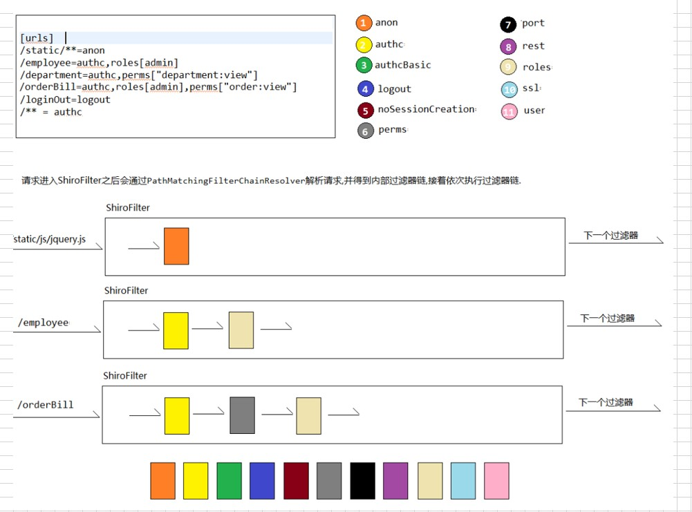

## 学习笔记 : Shiro的拦截机制

### 默认拦截器
*Shiro内置了很多默认的拦截器,比如身份验证、授权等相关的.更多默认拦截器可以参考 `org.apache.shiro.web.filter.mgt.DefaultFilter`中的枚举拦截器,如下所示 :*
```java
/**
 * Enum representing all of the default Shiro Filter instances available to web applications.  
 * Each filter instance is typically accessible 
 * in configuration the {@link #name() name} of the enum constant.
 *
 * @since 1.0
 */
public enum DefaultFilter {

    anon(AnonymousFilter.class),
    authc(FormAuthenticationFilter.class),
    authcBasic(BasicHttpAuthenticationFilter.class),
    logout(LogoutFilter.class),
    noSessionCreation(NoSessionCreationFilter.class),
    perms(PermissionsAuthorizationFilter.class),
    port(PortFilter.class),
    rest(HttpMethodPermissionFilter.class),
    roles(RolesAuthorizationFilter.class),
    ssl(SslFilter.class),
    user(UserFilter.class);

    private final Class<? extends Filter> filterClass;

    private DefaultFilter(Class<? extends Filter> filterClass) {
        this.filterClass = filterClass;
    }

    public Filter newInstance() {
        return (Filter) ClassUtils.newInstance(this.filterClass);
    }

    public Class<? extends Filter> getFilterClass() {
        return this.filterClass;
    }

    public static Map<String, Filter> createInstanceMap(FilterConfig config) {
        Map<String, Filter> filters = new LinkedHashMap<String, Filter>(values().length);
        for (DefaultFilter defaultFilter : values()) {
            Filter filter = defaultFilter.newInstance();
            if (config != null) {
                try {
                    filter.init(config);
                } catch (ServletException e) {
                    String msg = "Unable to correctly init default filter instance of type " +
                            filter.getClass().getName();
                    throw new IllegalStateException(msg, e);
                }
            }
            filters.put(defaultFilter.name(), filter);
        }
        return filters;
    }
}
```




| 过滤器简称 |                           对应的java类                            |
| :--------: | :--------------------------------------------------------------: |
|    anon    |        org.apache.shiro.web.filter.authc.AnonymousFilter         |
|   authc    |    org.apache.shiro.web.filter.authc.FormAuthenticationFilter    |
| authcBasic | org.apache.shiro.web.filter.authc.BasicHttpAuthenticationFilter  |
|   roles    |    org.apache.shiro.web.filter.authz.RolesAuthorizationFilter    |
|   perms    | org.apache.shiro.web.filter.authz.PermissionsAuthorizationFilter |
|    user    |           org.apache.shiro.web.filter.authc.UserFilter           |
|   logout   |          org.apache.shiro.web.filter.authc.LogoutFilter          |
|    port    |           org.apache.shiro.web.filter.authz.PortFilter           |
|    rest    |   org.apache.shiro.web.filter.authz.HttpMethodPermissionFilter   |
|    ssl     |           org.apache.shiro.web.filter.authz.SslFilter            |


1. `anon` : 匿名拦截器,即不需要登录即可访问. 一般用于静态资源过滤,示例"/static/**=anon"
2. `authc` : 表示需要认证(登录)才能使用,示例"/**=authc",主要属性有 : 
   * usernameParam : 表单提交的用户名参数名(username)
   * passwordParam : 表单提交的密码参数名(password)
   * rememberMeParam : 表单提交的密码参数名(rememberMe)
   * loginUrl : 登录请求地址(/login.jsp)
   * successUrl : 登录成功后的默认重定向地址
   * failureKeyAttribute : 登录失败后错误信息存储key(shiroLoginFailure)
3. `authcBasic` : Basic HTTP身份验证拦截器,主要属性 : applicationName:弹出登录框显示的信息(application)
4. `roles` : 角色授权拦截器,验证用户是否拥有资源角色. 示例"/admin/**=roles[admin]"
5. `perms` : 权限授权拦截器,验证用户是否拥有资源权限. 示例"/user/create=perms["user:create"]"
6. `user` : 用户拦截器,用户已经身份验证/记住我的登录. 示例"/index=user"
7. `logout` : 退出拦截器,主要属性 : redirectUrl:退出成功后重定向的地址(/). 示例"/logout=logout"
8. `port` : 端口拦截器,主要属性 : port(80):可以通过的端口. 示例"/test= port[80]",如果用户访问该页面是非80,将自动将请求端口改为80并重定向到该80端口,其他路径/参数等相同
9.  `rest` : rest风格拦截器,自动根据请求方法构建权限字符串(GET=read,POST=create,PUT=update,DELETE=delete,HEAD=read,TRACE=read,OPTIONS=read, MKCOL=create)构建权限字符串. 示例"/users=rest[user]",会自动拼出"user:read,user:create,user:update,user:delete"权限字符串进行权限匹配(所有都得匹配:isPermittedAll)
10. `ssl` : SSL拦截器,只有请求协议是https才能通过. 否则自动跳转会https端口(443). 其他和port拦截器一样


* 注 : anon,authcBasic,auchc,user是认证过滤器. perms,roles,ssl,rest,port是授权过滤器