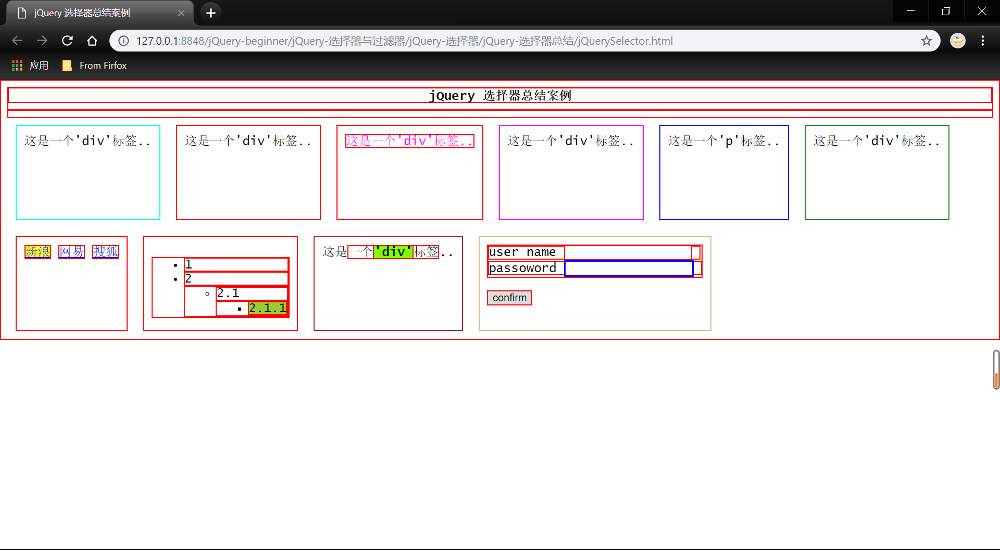

### 为了配合`Java web`项目的学习今天开始学习了`jQuery` 啦 !

- *要知道计算机语言之间是互通的,已学习`C`和`Java`的我学习`jQuery`起来是如此的高效,基本一天就可以学习半本书哟..*

#### 下面是我下午学习`jQuery选择器`的总结代码.嘿嘿,案例是不是也很搞笑(高效)呢 ?! 啊哈哈 ヾ(◍°∇°◍)ﾉﾞ

- *代码示例 ( `jQuery vision : jquery-1.12.4.js`,目前官方最新版本是: `jquery-3.3.1.js` )*
```html
<!DOCTYPE html>
<html>
	<head>
		<meta charset="utf-8">
		<title>jQuery 选择器总结案例</title>
		<script src="../../../jQuerySource/jquery-1.12.4.js"></script>
		<script type="text/javascript">
			//全局选择器 (Global Select) : 用于选择文档中所有的元素.
			$(document).ready(function() {
				$("*").css("border", "1px solid red");
			});
			//元素选择器 (Element Select) : 用于选择所有指定标签名称的元素.
			$(document).ready(function() {
				$("p").css("border", "1px solid blue");
			});
			//ID选择器 (ID Select) : 用于选择指定ID名称的单个元素.
			$(document).ready(function() {
				$("#test01").css("border", "1px solid aqua");
			});
			//类选择器 (Class Select) : 用于筛选出具有同一个class属性的所有元素.
			$(document).ready(function() {
				$(".style01").css("border", "1px solid fuchsia");
			});
			//多重选择器 (Multiple Select) : 适用于需要批量处理的多种元素.
			$(document).ready(function() {
				$("h3,div.style02").css("border", "1px solid forestgreen");
			});
			//属性选择器 (Attribute Select) : 选择具有指定属性要求的元素.
			$(document).ready(function() {
				$("[href$='.cn']").css("background-color", "yellow");
			});
			//表单选择器 (Form Select) : 用于选择指定类型或处于指定状态的表单元素.
			$(document).ready(function() {
				$(":password").css("border", "2px solid blue");
			});
			//子元素选择器 (Child Select) : 只能选择指定元素的第一层子元素.
			$(document).ready(function() {
				$("ul.ul-2>li").css("background-color", "yellowgreen");
			});
			//后代选择器 (Descendant Select) : 选择指定元素内包含的所有后代元素.比子元素选择器的涵盖范围更广.
			$(document).ready(function() {
				$("div.style04 strong").css("background-color", "chartreuse");
			});
			//后相邻选择器 (Next Adjacent Select) : 用于选择与指定元素相邻的后一个元素.
			$(document).ready(function() {
				$("div.style03+div").css("border", "1px solid brown");
			});
			//后兄弟选择器 (Next Siblings Selector) : 可用于选择指定元素后面跟随的所有符合条件的兄弟节点元素.
			$(document).ready(function() {
				$("div.style04~div").css("border", "1px solid burlywood");
			});
			//CSS 选择器 (CSS Selector) : 用于改变指定HTML元素的CSS属性. 
			$(document).ready(function() {
				$("#test03 span").css("color", "fuchsia");
			});
		</script>
		<style type="text/css">
			h4 {
				margin: 0;
				text-align: center;
				font-family: "lucida console";
			}

			div,
			p {
				width: auto;
				height: 100px;
				float: left;
				padding: 10px;
				margin: 10px;
				font-family: "lucida console";
				border: 1px solid greenyellow;
			}
		</style>
	</head>
	<body>
		<h4>jQuery 选择器总结案例</h4>
		<hr />
		<div id="test01">
			这是一个'div'标签..
		</div>
		<div id="test02">
			这是一个'div'标签..
		</div>
		<div id="test03">
			<span>这是一个'div'标签..</span>
		</div>
		<div class="style01">这是一个'div'标签..</div>
		<p>
			这是一个'p'标签..
		</p>
		<div class="style02">这是一个'div'标签..</div>
		<div>
			<a href="http://www.sina.com.cn">新浪</a>
			<a href="http://163.com">网易</a>
			<a href="http://www.sohu.com">搜狐</a>
		</div>
		<div class="style03">
			<ul class="ul-1">
				<li>1</li>
				<li>2</li>
				<ul>
					<li>2.1</li>
					<ul class="ul-2">
						<li>2.1.1</li>
					</ul>
				</ul>
			</ul>
		</div>
		<div class="style04">
			这是<span>一个<strong>'div'</strong>标签</span>..
		</div>
		<div>
			<form method="post" action="URL">
				<label>user name
					<input type="text" name="username" required />
				</label><br />
				<label>passoword
					<input type="password" name="password" required />
				</label><br />
			</form><br>
			<button type="submit">confirm</button>
		</div>
	</body>
</html>
```

- *运行效果 ( 是不是以为我会做的花里胡哨的呢,嘿嘿这里只是为了学习所以就简单点吧,后期深入学习后有时间会写一些特炫的网页给大家的 ~ )*
  
- 