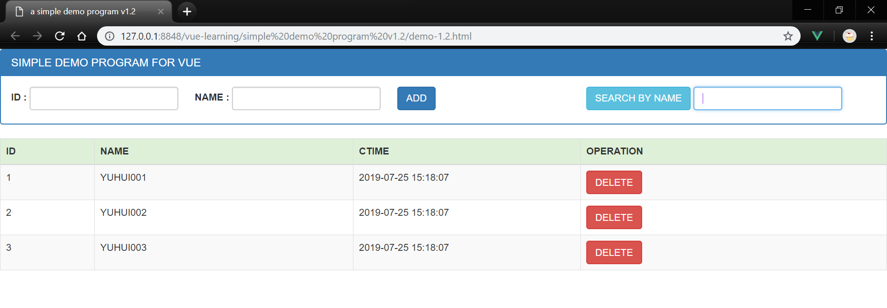

## 案例笔记 : 一个基于Vue.js的简单信息管理页
*初步学习完`Vue.js`的基本语法、数据绑定视图机制、事件绑定、自定义指令、过滤器后,来尝试写一个总结案例吧~ 该案例的主要功能是一个简单的信息管理 : 增加,删除,查找. 该程序其它版本见 : https://github.com/YUbuntu0109/vue-learning*

*(simple demo program v1.2/demo-1.2.html)程序如下所示 :*
```html
<!DOCTYPE html>
<html>
	<head>
		<meta charset="utf-8">
		<script src="../vue.js"></script>
		<link rel="stylesheet" href="../simple%20demo%20program%20v1.0/resources/bootstrap.css" />
		<title>a simple demo program v1.2</title>
	</head>
	<body>
		<div id="app">
			<div class="panel panel-primary">
				<div class="panel-heading">
					<h3 class="panel-title">SIMPLE DEMO PROGRAM FOR VUE</h3>
				</div>
				<div class="panel-body form-inline">
					<label>
						ID : <input type="text" class="form-control" v-model="id" />
					</label>
					<label style="padding-left: 20px;">
						NAME : <input type="text" class="form-control" v-model="name" @keyup.enter="add()" />
					</label>
					<label>
						<button class="btn btn-primary" style="margin-left:20px ;" @click="add()">ADD</button>
					</label>
					<label style="padding-left: 213px;">
						<button class="btn btn-info">SEARCH BY NAME</button>
						<input type="text" class="form-control" v-model="keyword" v-focus v-color="'blueviolet'" />
					</label>
				</div>
			</div>
			<table class="table table-bordered table-hover table-striped">
				<thead>
					<tr class="success">
						<th>ID</th>
						<th>NAME</th>
						<th style="width: 328px;">CTIME</th>
						<th>OPERATION</th>
					</tr>
				</thead>
				<tbody>
					<tr v-for="user in search(keyword)" v-bind:key="user.id">
						<td>{{user.id}}</td>
						<td>{{user.name}}</td>
						<td>{{user.ctime | dateStrFilter('')}}</td>
						<td><button class="btn btn-danger" @click="del(user.id)">DELETE</buttom>
						</td>
					</tr>
				</tbody>
			</table>
		</div>
		<script>
			Vue.filter('dateStrFilter', function(dateStr, datePattern = "") { //the default is null
				var newDateStr = new Date(dateStr)
				var year = newDateStr.getFullYear()
				var month = (newDateStr.getMonth() + 1).toString().padStart(2, '0') //padStart():complete the length of the string
				var date = newDateStr.getDate().toString().padStart(2, '0')
				var hour = newDateStr.getHours().toString().padStart(2, '0')
				var m = newDateStr.getMinutes().toString().padStart(2, '0')
				var s = newDateStr.getSeconds().toString().padStart(2, '0')

				if (datePattern.toLowerCase() === 'yyyy-mm-dd') {
					return `${year}-${month}-${date}`
				} else {
					return `${year}-${month}-${date} ${hour}:${m}:${s}`
				}
			});

			Vue.directive('focus', {
				inserted: function(el) {
					el.focus()
				}
			});
			Vue.directive('color', {
				bind: function(el, colorStr) {
					el.style.color = colorStr.value
				}
			});

			var vm = new Vue({
				el: '#app',
				data: {
					id: '',
					name: '',
					keyword: '',
					users: [{
							id: 1,
							name: 'YUHUI001',
							ctime: new Date()
						},
						{
							id: 2,
							name: 'YUHUI002',
							ctime: new Date()
						},
						{
							id: 3,
							name: 'YUHUI003',
							ctime: new Date()
						}
					]
				},
				methods: {
					add() {
						var user = {
							id: this.id,
							name: this.name,
							ctime: new Date()
						}
						//The elements to add to the end of the array. 
						this.users.push(user)
						this.id = this.name = ''
					},
					del(id) {
						var index = this.users.findIndex(user => {
							if (user.id == id) {
								return true;
							}
						});
						//The elements to add to the array.
						//If you don't specify any elements, splice simply removes elements from the array. 
						this.users.splice(index, 1)
					},
					search(keyword) {
						var newUsers = []
						this.users.forEach(user => {
							//If the keyword is null, it returns 0.
							if (user.name.indexOf(keyword) != -1) {
								newUsers.push(user)
							}
						});
						return newUsers;
					}
				}
			});
		</script>
	</body>
</html>
```

*程序运行效果示例图如下 :*
