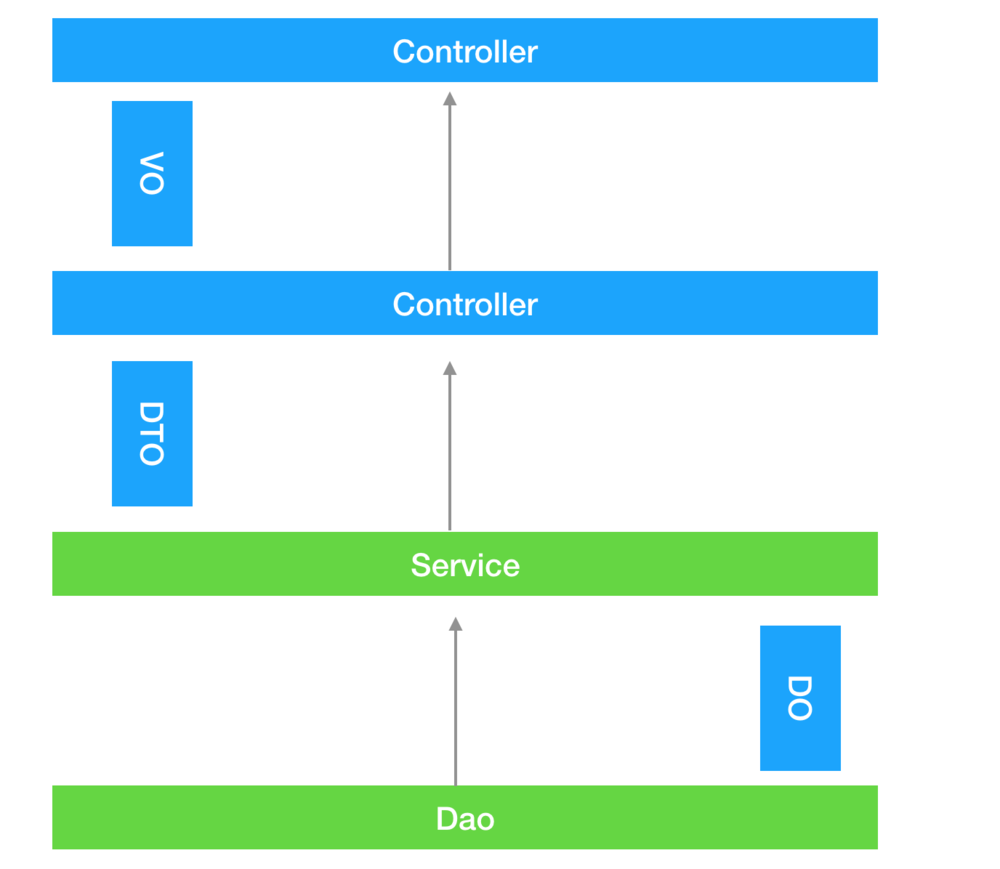

## 学习笔记 : 使用MyBatis完成通用DAO和通用Service

### 简介
*如 UserMapper 里面有 insert(User user) , find(Integer id) ,delete(Integer id) 等方法，则在 Service 中也要有这些方法的实现,假设每个 Mapper 有5个方法,则 Service 也需要有5个方法的实现. 如果有10个实体类, Mapper 可以省略( 可由工具生成 ),但是 Service 需要有这50个方法的实现. 既而后期会导致代码臃肿难以维护,且项目难以扩展哟~ 一般 Java 项目的分层结构图如下所示,详情请参考学习笔记 : [Java项目开发中PO,BO,VO,DTO,POJO,DAO的概念及其作用](https://yubuntu0109.github.io/2019/08/15/Java%E9%A1%B9%E7%9B%AE%E5%BC%80%E5%8F%91%E4%B8%ADPO-BO-VO-DTO-POJO-DAO%E7%9A%84%E6%A6%82%E5%BF%B5%E5%8F%8A%E5%85%B6%E4%BD%9C%E7%94%A8/)*




### 通用的DAO接口
```java
package pers.huangyuhui.memo.dao;

import java.io.Serializable;
import java.util.List;

/**
 * @project: memo
 * @description: 通用的Mapper接口
 * @author: 黄宇辉
 * @date: 8/22/2019-8:44 PM
 * @version: 1.0
 * @website: https://yubuntu0109.github.io/
 */
public interface BaseMapper<T, ID extends Serializable> {

    int deleteByPrimaryKey(ID[] id);

    int insert(T record);

    int insertSelective(T record);

    T selectByPrimaryKey(ID id);

    List<T> selectBySelective(T t);

    int updateByPrimaryKeySelective(T record);

    int updateByPrimaryKeyWithBLOBs(T record);

    int updateByPrimaryKey(T record);

}
```

### 通用的Service接口
```java
package pers.huangyuhui.memo.service;

import com.github.pagehelper.PageInfo;
import pers.huangyuhui.memo.object.BaseConditionVO;

import java.io.Serializable;
import java.util.List;

/**
 * @project: memo
 * @description: 通用的Service接口
 * @author: 黄宇辉
 * @date: 8/22/2019-8:54 PM
 * @version: 1.0
 * @website: https://yubuntu0109.github.io/
 */
public interface BaseService<T, ID extends Serializable> {

    void setBaseMapper();

    int deleteByPrimaryKey(ID[] id);

    int insert(T record);

    int insertSelective(T record);

    T selectByPrimaryKey(ID id);

    List<T> selectBySelective(T record);

    PageInfo<T> selectForPage(T reccord, BaseConditionVO baseConditionVO);

    int updateByPrimaryKeySelective(T record);

    int updateByPrimaryKeyWithBLOBs(T record);

    int updateByPrimaryKey(T record);
}
```

#### 通用的Service实现类
```java
package pers.huangyuhui.memo.service.impl;

import com.github.pagehelper.PageHelper;
import com.github.pagehelper.PageInfo;
import pers.huangyuhui.memo.object.BaseConditionVO;
import pers.huangyuhui.memo.dao.BaseMapper;
import pers.huangyuhui.memo.service.BaseService;

import java.io.Serializable;
import java.util.List;

/**
 * @project: memo
 * @description: 通用的Service实现类
 * @author: 黄宇辉
 * @date: 8/22/2019-8:55 PM
 * @version: 1.0
 * @website: https://yubuntu0109.github.io/
 */
public abstract class AbstractService<T, ID extends Serializable> implements BaseService<T, ID> {

    private BaseMapper<T, ID> baseMapper;

    //初始化baseMapper
    public void setBaseMapper(BaseMapper<T, ID> baseMapper) {
        this.baseMapper = baseMapper;
    }

    @Override
    public int deleteByPrimaryKey(ID[] id) {
        return baseMapper.deleteByPrimaryKey(id);
    }

    @Override
    public int insertSelective(T record) {
        return baseMapper.insertSelective(record);
    }

    @Override
    public T selectByPrimaryKey(ID id) {
        return baseMapper.selectByPrimaryKey(id);
    }

    @Override
    public List<T> selectBySelective(T record) {
        return baseMapper.selectBySelective(record);
    }

    @Override
    public PageInfo<T> selectForPage(T record, BaseConditionVO baseConditionVO) {
        PageHelper.startPage(baseConditionVO.getPageNum(), baseConditionVO.getPageSize()); //设置每页的记录数
        List<T> list = baseMapper.selectBySelective(record); //获取列表信息
        return new PageInfo<>(list);
    }

    @Override
    public int updateByPrimaryKeySelective(T record) {
        return baseMapper.updateByPrimaryKey(record);
    }

    @Override
    public int updateByPrimaryKeyWithBLOBs(T record) {
        return baseMapper.updateByPrimaryKeyWithBLOBs(record);
    }

    @Override
    public int updateByPrimaryKey(T record) {
        return baseMapper.updateByPrimaryKey(record);
    }

    @Override
    public int insert(T record) {
        return baseMapper.insert(record);
    }
}
```

#### 具体的Mapper写法
```java
package pers.huangyuhui.memo.dao;

import org.springframework.stereotype.Repository;
import pers.huangyuhui.memo.bean.Friend;

import java.util.List;

/**
 * @project: memo
 * @description: 好友信息数据访问层
 * @author: 黄宇辉
 * @date: 2019-08-25 10:06 AM
 * @version: 2.0
 * @website: https://yubuntu0109.github.io/
 */
@Repository
public interface FriendMapper extends BaseMapper<Friend, Integer> {

    // TODO: 8/23/2019 添加好友信息
    @Override
    int insertSelective(Friend friend);

    // TODO: 8/23/2019 选择性查询好友信息
    @Override
    List<Friend> selectBySelective(Friend friend);

    // TODO: 8/23/2019 更新好友信息
    @Override
    int updateByPrimaryKey(Friend friend);

    // TODO: 8/23/2019 删除好友信息
    @Override
    int deleteByPrimaryKey(Integer[] id);
}
```

#### 具体的Service写法
```java
package pers.huangyuhui.memo.service;

import pers.huangyuhui.memo.bean.Friend;

import java.util.List;

/**
 * @project: memo
 * @description: 好友信息业务层
 * @author: 黄宇辉
 * @date: 2019-08-25 10:30 AM
 * @version: 1.0
 * @website: https://yubuntu0109.github.io/
 */
public interface FriendService extends BaseService<Friend, Integer> {

    // TODO: 8/25/2019 添加好友信息 
    @Override
    int insertSelective(Friend friend);

    // TODO: 8/25/2019 选择性查询好友信息 
    @Override
    List<Friend> selectBySelective(Friend friend);

    // TODO: 8/25/2019 更新好友信息 
    @Override
    int updateByPrimaryKey(Friend friend);

    // TODO: 8/25/2019 删除好友信息
    @Override
    int deleteByPrimaryKey(Integer[] id);
}
```

#### 具体的Service实现类写法
```java
package pers.huangyuhui.memo.service.impl;

import com.github.pagehelper.PageInfo;
import org.springframework.beans.factory.annotation.Autowired;
import org.springframework.stereotype.Service;
import org.springframework.transaction.annotation.Transactional;
import pers.huangyuhui.memo.bean.Friend;
import pers.huangyuhui.memo.dao.FriendMapper;
import pers.huangyuhui.memo.object.BaseConditionVO;
import pers.huangyuhui.memo.service.FriendService;

import java.util.List;

/**
 * @project: memo
 * @description: 好友信息业务层的实现类
 * @author: 黄宇辉
 * @date: 8/22/2019-x:xx PM
 * @version: 1.0
 * @website: https://yubuntu0109.github.io/
 */
@Service
@Transactional
public class FriendServiceImpl extends AbstractService<Friend, Integer> implements FriendService {

    @Autowired
    private FriendMapper friendMapper;

    //the method must be implemented
    //注:记得注入对象哟,不然会报空指针异常,因为在实际掉用的时候不是BaseMapper调用,而是这个friendMapper
    @Autowired
    @Override
    public void setBaseMapper() { 
        super.setBaseMapper(friendMapper);
    }

    @Override
    public int insertSelective(Friend record) {
        return super.insertSelective(record);
    }

    @Override
    public List<Friend> selectBySelective(Friend record) {
        return super.selectBySelective(record);
    }

    @Override
    public PageInfo<Friend> selectForPage(Friend record, BaseConditionVO baseConditionVO) { 
        return super.selectForPage(record, baseConditionVO); 
    }

    @Override
    public int updateByPrimaryKeySelective(Friend record) {
        return super.updateByPrimaryKeySelective(record);
    }

    @Override
    public int deleteByPrimaryKey(Integer[] id) {
        return super.deleteByPrimaryKey(id);
    }

}
```


*更多实现细节请参考我的 SpringBoot 小项目 : https://github.com/YUbuntu0109/springboot-beginner/tree/refactor-190823*